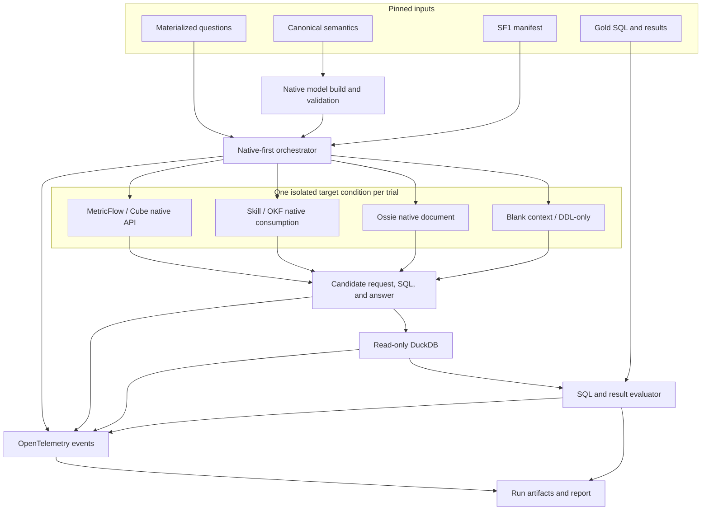
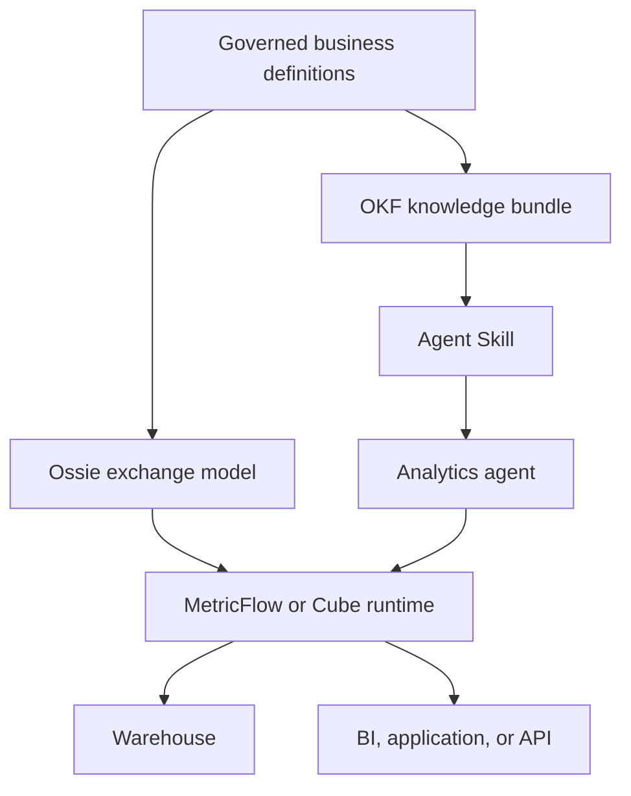

# Semantic Layer Benchmark

[English](README.md) | [简体中文](README.zh-CN.md)

A reproducible and observable benchmark for studying how semantic engines, interchange formats, and agent knowledge packages affect analytics accuracy on one shared workload.

The project compares **MetricFlow, Cube, Apache Ossie, Open Knowledge Format (OKF), and an Agent Skill**, with separate **blank-context** and **DDL-only** controls. It evaluates SQL and result quality first, semantic-model structure second, and operational behavior across both phases.

> **Project status:** work in progress. TPC-DS-derived SF1 is the initial workload. The repository already contains 99 canonical questions, 103 attributed PostgreSQL reference SQL formulations, a DuckDB schema and loader, q01-q10 DuckDB reference SQL, a read-only database adapter, a candidate canonical metric contract, and initial Skill, OKF, MetricFlow, and Ossie representations. Cube, end-to-end target adapters, evaluators, and trace collection are still planned. Documentation below distinguishes implemented assets from the experimental design.

## What this benchmark is trying to answer

The benchmark is designed around five questions:

1. Does semantic context improve execution-correct answers over blank-context and DDL-only baselines?
2. Which failures come from natural-language planning, semantic modeling, SQL compilation, or database execution?
3. How faithfully can each representation encode the same metrics, dimensions, joins, grains, and time rules?
4. What are the latency, token, tool-call, retry, and cost trade-offs of each intended usage pattern?
5. Which components should be combined in a production architecture instead of treated as substitutes?

The benchmark does **not** assume that all five targets are the same kind of product.

## Target roles: what is actually being compared

| Target | Primary role | Intended use in this benchmark | Produces SQL natively? |
| --- | --- | --- | --- |
| MetricFlow | Metric compiler and semantic query engine | An agent constructs a metric request; MetricFlow validates the semantic graph and compiles SQL | Yes |
| Cube | Semantic-layer service and query API | An agent discovers members and submits one declared native query variant to a running Cube service | Yes |
| Apache Ossie | Semantic-model interchange specification | A validator and reference adapter load the Ossie document; an agent consumes it, with interoperability tested separately | No standalone runtime is assumed |
| OKF | Portable knowledge representation | The agent directly navigates the original Markdown, frontmatter, indexes, and links, then writes SQL | No |
| Skill | Agent workflow and progressively disclosed context | The agent activates `SKILL.md`, loads referenced knowledge as needed, and writes SQL | No |
| DDL-only | Control condition | The same agent receives only the physical schema and question | Agent writes SQL directly |
| Blank context | Control condition | A fresh agent receives no preloaded schema or semantics and discovers the native database catalog | Agent writes SQL directly |

MetricFlow and Cube can therefore be compared as native semantic runtimes. Skill and OKF can be compared as agent knowledge delivery mechanisms. Ossie is primarily evaluated as a portable model and, in end-to-end tests, through an explicitly named adapter. Unsupported capabilities are reported as `not_applicable` or `unsupported`; they are never silently scored as zero.

## Shared benchmark contract

The initial workload is **TPC-DS-derived SF1 only**. SF10 remains out of scope.

| Contract | Frozen input |
| --- | --- |
| Workload | 99 stable task IDs, `q01` through `q99` |
| Reference logic | 103 SQL formulations; q14, q23, q24, and q39 each have two accepted formulations |
| Data | One SF1 snapshot plus row counts, checksums, generator version, and manifest hash |
| Database | DuckDB 1.4.0 by default, opened read-only through a pluggable connection contract |
| Semantics | One system-neutral catalog of datasets, metrics, dimensions, joins, grains, time roles, and calculation rules |
| Agent | The same model, prompt shell, budgets, retry policy, and generation parameters within a lane; only the declared native operation allowlist changes by target |
| Observability | The same run, trace, token, tool-call, timing, artifact, and error schema |

The workload is intentionally pluggable. A future enterprise SaaS workload can be added as a new workload pack—data manifest, questions, reference results, and canonical semantics—without changing evaluator or target-adapter contracts.

## Benchmark architecture



The gold SQL, expected results, and question-to-metric map are evaluator-only assets. A target never receives them. Each trial exposes one materialized question and only the artifacts and operations declared for that target. Observability wrappers may record a native call, but they may not rewrite it into a universal semantic interface.

## Experimental lanes

A single leaderboard would hide important differences, so the benchmark publishes separate lanes and a metric vector for each lane.

| Phase and lane | Question answered | Participants | Output |
| --- | --- | --- | --- |
| Phase 1A: native end-to-end | How well does each target work when used as intended? | All five targets plus blank-context and DDL-only controls | Native request, generated SQL where observable, and final result |
| Phase 1B: native serving | What does deterministic semantic compilation and serving cost? | MetricFlow and Cube only | Compile/serve result, cold and warm latency, and engine diagnostics |
| Phase 1C: controlled-context ablation | How useful is extracted semantic information after removing native runtime behavior? | Explicit secondary variants only | Agent-generated DuckDB SQL using normalized evidence; never reported as native behavior |
| Phase 2: semantic structure | How completely and faithfully is the canonical contract represented? | All five semantic targets | Coverage and fidelity manifest with native validation results |
| Phase 3: operations | What resources and failure modes occur? | Every applicable Phase 1 trial | Traces, tokens, tools, retries, timing, errors, and estimated cost |

### Native end-to-end lane

This is the primary result. Each target retains its native artifact, discovery behavior, and execution surface:

- MetricFlow: the agent selects metrics, dimensions, filters, and time bounds; MetricFlow compiles the request to SQL.
- Cube: the agent inspects `/v1/meta` and calls `/v1/load` in the REST variant. Semantic SQL is measured as a separate native variant.
- Skill: the agent activates the Skill and progressively loads only the referenced instructions and concepts it needs.
- OKF: the agent directly navigates the original Markdown bundle, YAML frontmatter, indexes, and links, then writes SQL.
- Ossie: the consumer exposes the original validated Ossie YAML to the agent, which writes SQL. Any execution through another engine is a separate interoperability variant.
- DDL-only: the agent receives the physical DuckDB DDL but no enriched semantics, then writes SQL.
- Blank context: the agent begins with no table, column, metric, or document context; it may discover the DuckDB catalog and write read-only SQL.

Every agent trial starts a fresh conversation with the same common prompt shell and generation policy. The native allowlist changes by target; undeclared direct-SQL fallbacks are recorded as protocol violations.

### Controlled-context ablation

Normalized `SemanticEvidence` chunks are permitted only in this separately named secondary experiment. It helps isolate representation content after native behavior has been removed, but its scores cannot be merged into or substituted for the native results.

## How each target is used

| Target | Artifact under test | Adapter surface | SQL author | Typical application |
| --- | --- | --- | --- | --- |
| MetricFlow | Native semantic-model and metric YAML | Metric/dimension discovery plus compile/query command | MetricFlow compiler after agent planning | Governed metric definitions and reusable dimensional queries |
| Cube | Cube YAML or JavaScript data model | `/v1/meta` plus one declared native query API per variant | Cube runtime | Semantic APIs for BI, embedded analytics, and agents |
| Ossie | One complete YAML document containing datasets, fields, relationships, and metrics | Native schema validation and original-document inspection | Reference agent, unless an interoperability variant is declared | Moving a semantic model between compatible tools |
| OKF | Markdown concepts with YAML frontmatter and indexes | Direct file, frontmatter, index, and link navigation | Reference agent | Portable business context, provenance, and curated knowledge |
| Skill | `SKILL.md` plus optional references and scripts | Native activation and progressive file reads | Reference agent | Repeatable agent instructions and task-specific expertise |
| Blank context | No preloaded schema or semantics | Native database catalog discovery and read-only SQL | Reference agent | Zero-preloaded-context baseline |

One Ossie YAML file does not mean one table. In the official model shape, the top-level semantic model is a container and its `datasets` collection contains the logical fact and dimension tables.

## One trial, step by step

1. Resolve and record the workload, data-manifest, repository, model, prompt, adapter, and target-version pins.
2. Start exactly one isolated target condition and pass its health and native-validation gates.
3. Load one materialized question, but keep reference SQL, reference results, and canonical mappings outside the target sandbox.
4. Start a fresh provider conversation and root trace with the target's exact native operation allowlist.
5. Capture the complete sanitized message sequence, native requests, tool results, and generated SQL where observable.
6. Accept one final result submission; reject writes, undeclared fallbacks, and multi-statement SQL outside the question contract.
7. Close the target sandbox, then load evaluator-only assets and compare normalized results.
8. Persist the trace, artifacts, hashes, usage, error classification, and score under one `run_id` and `trial_id`.

## Fairness and validity rules

- **Same semantics:** native models must be translated from the canonical contract. A target cannot receive extra business facts that others do not receive.
- **No gold leakage:** reference SQL, results, evaluator rules, and question-to-metric mappings are outside the target sandbox.
- **Same model within a lane:** provider, model revision, temperature, seed where supported, prompt shell, maximum output, and retry policy are pinned.
- **No native normalization:** the primary lane preserves each target's original artifact and intended interface. Common chunking and retrieval exist only in the separately labeled ablation lane.
- **Capability-matched native use:** each native adapter may expose the target’s intended interface, but the interface and all tool calls are recorded.
- **Read-only execution:** targets cannot mutate the database. Credentials and sensitive environment values are never placed in prompts or traces.
- **Cache separation:** correctness runs use uncached results. Cold-start, warm-process, and engine-cache measurements are separate scenarios.
- **Resource isolation:** latency runs are sequential initially, with pinned CPU, memory, timeout, and container-image digest. A warm-up trial is excluded from timing summaries.
- **Repeated trials:** the default design uses three independent trials per question and condition. Target and question order is randomized and recorded.
- **Explicit limitations:** native validation failure, unsupported semantics, adapter fallback, and query-layer workarounds are surfaced rather than hidden.

## Evaluation

### Phase 1: SQL and result quality

Result equivalence is the primary correctness measure because two structurally different SQL statements can be semantically equivalent. Textual SQL equality is diagnostic only.

| Measure | Meaning |
| --- | --- |
| Execution accuracy | Normalized candidate result equals the accepted reference result |
| SQL execution rate | Candidate SQL parses, binds, and executes within policy |
| Semantic component accuracy | Correct tables, columns, joins, filters, aggregations, grouping, ordering, and limit behavior |
| Native-plan accuracy | Agent selected the correct metrics, dimensions, filters, and time roles before compilation |
| Answer completeness | All required outputs for a question are returned; q14, q23, q24, and q39 retain one question-level denominator |
| Stability | Agreement across repeated trials for the same question and condition |

### Phase 2: semantic-structure quality

The structure evaluator compares native artifacts against canonical IDs and records:

- dataset, field, dimension, entity, relationship, and role-playing join coverage;
- base, derived, cumulative, ratio, and query-exact metric coverage;
- fact grain, aggregation time, dimension reachability, additivity, null, and division-by-zero fidelity;
- native expression versus query-layer workaround versus unsupported status;
- native parser/schema/semantic validation results;
- provenance, documentation, reuse, and machine-discoverability signals.

The report publishes counts and per-capability rates instead of hiding them behind one subjective aggregate score.

### Statistics

- Accuracy differences are paired by question. Report point estimates, 95% confidence intervals, and paired significance tests where assumptions are met.
- Latency, tokens, tool calls, and cost are reported as median, p95, and distribution—not only averages.
- Results are stratified by question complexity, join count, metric type, channel, and whether the requested logic is natively representable.
- `not_applicable` values are excluded from denominators and displayed separately.

## Observability contract

Every trial emits a root span with child events or spans for `context.retrieve`, `llm.generate`, `tool.call`, `semantic.compile`, `db.execute`, and `evaluate` when applicable.

| Category | Required fields |
| --- | --- |
| Identity | `run_id`, `trial_id`, `question_id`, target, lane, repetition, timestamps |
| Reproducibility | repository SHA, workload revision, manifest SHA-256, native-model SHA-256, adapter version, image digest |
| Model usage | provider, model revision, generation parameters, prompt hash, input/output/cached tokens where reported |
| Tool usage | ordered tool name, sanitized arguments, result metadata, status, latency, retry linkage |
| Semantic work | retrieved concept IDs, native request, compile status, fallback or workaround flags |
| SQL work | generated SQL artifact, statement policy, execution time, row count, result hash |
| Errors | stage, normalized category, native code, retryability, sanitized message |
| Cost | model usage, target-service usage, and database cost under a pinned price snapshot when available |

Raw secrets are never logged. Provider-hidden reasoning is not requested or inferred. A missing provider usage field is recorded as unavailable, not estimated silently.

## Execution environment

The first reproducible environment is local and DuckDB-first:

| Component | Baseline environment | State |
| --- | --- | --- |
| Orchestrator and evaluators | Linux, Python 3.11+, repository revision pinned | Versioned contracts present; execution implementation planned |
| Database | DuckDB 1.4.0, SF1 database file mounted read-only | Schema, loader, and read-only adapter present |
| MetricFlow | Pinned standalone source at commit `8750c1d`; DuckDB SQL renderer selected by adapter | Table semantics present; executable adapter planned |
| Cube | Pinned Cube image, isolated service, official DuckDB data source, cache disabled for correctness runs | Native model and adapter planned |
| Skill | Same reference-agent runtime; package mounted in a temporary repository skill location | Table and metric knowledge present; harness integration planned |
| OKF | Same reference-agent runtime with direct allowlisted Markdown and link navigation | Table and metric bundle present; native consumer pending |
| Ossie | Pinned schema validator and transparent original-document consumer | Model present and schema-validated; consumer pending |
| Telemetry | OpenTelemetry-compatible collector with local trace artifacts; Phoenix is an optional viewer | Event contract present; capture pending |

Cube officially supports a local DuckDB database path. The pinned MetricFlow source contains a DuckDB SQL renderer, so the planned self-hosted condition can execute its native metric query against DuckDB and expose compiled SQL for diagnosis. This benchmark does not claim that every current dbt product deployment officially supports DuckDB. The executable compatibility gate must pass for the pinned benchmark version before results are published.

The database contract remains pluggable through `BENCHMARK_DATABASE_URL`, catalog, schema, and dialect configuration. A different backend is valid only when every compared execution path uses the same data snapshot and logical relation contract. PostgreSQL reference SQL remains a formula and result oracle; PostgreSQL is not the default runtime.

## Local setup

TPC-DS data is generated locally with the official toolkit and is not committed.

```bash
python -m venv .venv
source .venv/bin/activate
pip install -e '.[test]'
```

1. Download the TPC-DS v4.0.0 tools from the [official TPC download page](https://www.tpc.org/TPC_Documents_Current_Versions/download_programs/tools-download-request5.asp?bm_type=TPC-DS&bm_vers=4.0.0&mode=CURRENT-ONLY).
2. Build the toolkit and run `dsdgen -scale 1`.
3. Place the generated `.dat` files in `data/tpcds/sf1/generated/`.
4. Create the database and reproducibility manifest:

```bash
python scripts/load_tpcds_sf1.py --generator-binary /path/to/dsdgen
pytest -q
```

The loader records the native `dsdgen` binary hash, DuckDB version, physical inputs, and logical snapshot identity. The default URL is `duckdb:///./data/tpcds/sf1/tpcds.duckdb`. See [`data/tpcds/sf1/README.md`](data/tpcds/sf1/README.md) and [`runner/config/README.md`](runner/config/README.md) for details. q01-q10 currently pass parse, bind, and empty-schema execution checks; SF1 result equivalence remains a separate gate until a generated-data manifest is available.

## How these pieces are applied in practice

The five targets are often complementary in a real system:



- Choose MetricFlow or Cube when deterministic metric compilation and a governed serving interface are the main requirement.
- Choose Ossie when model interchange, import/export, or migration is the main requirement; pair it with an execution engine.
- Choose OKF when business context, provenance, and knowledge portability must be readable by humans and agents.
- Choose a Skill when the agent needs repeatable instructions about when and how to discover and apply that knowledge.
- A common production pattern is **engine + exchange model + knowledge bundle + Skill**, not one universal winner.

## Repository layout

| Path | Purpose |
| --- | --- |
| `benchmark/tpcds/questions/canonical/` | Canonical questions and per-question provenance |
| `benchmark/tpcds/questions/instances/` | Materialized, target-visible question instances with evaluator-only compartments |
| `benchmark/tpcds/sql/reference/duckdb/` | DuckDB reference translations and validation state |
| `benchmark/tpcds/sql/reference/postgres/` | Attributed PostgreSQL formula/reference SQL |
| `benchmark/tpcds/sql/generated/` | SQL produced by each target and trial |
| `data/tpcds/schema/duckdb/` | DuckDB physical schema |
| `data/tpcds/sf1/` | Generated SF1 database, manifest, and local data location |
| `semantic-models/canonical/` | System-neutral semantic and metric contract |
| `semantic-models/{target}/` | Native representation for each target |
| `runner/config/` | Pluggable database, native target registry, and experiment configurations |
| `runner/contracts/` | Versioned experiment, question, trace, trial, and run JSON Schemas |
| `runner/prompts/` | Frozen common Agent prompts and conversation protocol |
| `runner/tools/` | Exact target-visible tool schemas, starting with the blank-context baseline |
| `runner/examples/` | Non-result protocol examples and illustrative transcripts |
| `runner/adapters/` | Planned target-specific adapter boundary |
| `evaluators/` | Planned SQL, result, and structure evaluators |
| `observability/` | Planned telemetry configuration and sanitized trace artifacts |
| `runs/` | Run specifications and local run output |
| `reports/` | Generated benchmark reports |

Generated data, traces, run outputs, and reports are intentionally excluded from Git.

## Questions and SQL provenance

Every record in [`questions.jsonl`](benchmark/tpcds/questions/canonical/questions.jsonl) includes the canonical question, symbolic parameters, TPC-DS version and Appendix B section, official toolkit template path, local reference SQL, and pinned upstream source and licence.

The source precedence is:

1. [TPC-DS v4.0.0 specification](https://www.tpc.org/tpc_documents_current_versions/pdf/tpc-ds_v4.0.0.pdf), Appendix B, for business intent and numbering.
2. `query_templates/queryN.tpl` from the [official TPC-DS v4.0.0 toolkit](https://www.tpc.org/TPC_Documents_Current_Versions/download_programs/tools-download-request5.asp?bm_type=TPC-DS&bm_vers=4.0.0&mode=CURRENT-ONLY) for the functional definition.
3. Pinned, Apache-2.0, TPC-DS-derived PostgreSQL SQL for a reviewable fixed-parameter reference.
4. DuckDB translations validated against the same generated SF1 snapshot for executable result oracles.

The official toolkit is governed by the TPC EULA and is linked rather than vendored. See [`SOURCE.md`](benchmark/tpcds/sql/reference/postgres/SOURCE.md) and [`THIRD_PARTY_NOTICES.md`](THIRD_PARTY_NOTICES.md).

## Current progress

- [x] SF1-only repository scaffold
- [x] 99 canonical questions and 103 attributed PostgreSQL reference formulations
- [x] Candidate canonical metrics and q01-q99 mappings
- [x] Skill and OKF table and metric knowledge
- [x] MetricFlow and Ossie table semantics and base metric coverage
- [x] DuckDB schema, deterministic loader, and read-only pluggable adapter
- [x] q01-q10 DuckDB SQL with explicit validation levels
- [ ] Generated SF1 manifest with row counts and checksums
- [ ] q11-q99 DuckDB reference SQL and SF1 result equivalence
- [ ] Reviewed canonical dimensions, grains, joins, and metric semantics
- [ ] Cube native semantic model
- [x] Versioned experiment, question-instance, trial, run, and trace-event contracts
- [x] Native target registry, blank-context prompt protocol, and q01 materialized pilot
- [ ] Native target adapters and transparent observability wrappers
- [ ] SQL/result and structure evaluators
- [ ] OpenTelemetry event schema and trace capture
- [ ] Repeated-run benchmark report

## Planned implementation order

1. Implement preflight and the blank-context q01 runner against the frozen contracts.
2. Generate one SF1 manifest and validate the q01 reference result on DuckDB.
3. Materialize and review q02-q10, then q11-q99, without exposing evaluator fields to targets.
4. Implement DDL-only, Skill, OKF, Ossie, MetricFlow, and Cube native adapters without fallback.
5. Implement native Phase 1 execution/result evaluation before Phase 2 structure scoring.
6. Run the q01-q10 native pilot, review failures, then expand to all 99 questions. Run controlled-context ablations only as separate secondary experiments.

## Official format and runtime references

- [MetricFlow overview](https://docs.getdbt.com/docs/build/about-metricflow) and [MetricFlow commands](https://docs.getdbt.com/docs/build/metricflow-commands)
- [Cube semantic-layer architecture](https://docs.cube.dev/docs/introduction), [REST API](https://docs.cube.dev/reference/core-data-apis/rest-api), and [DuckDB data source](https://docs.cube.dev/admin/connect-to-data/data-sources/duckdb)
- [Apache Ossie core semantic-model specification](https://github.com/apache/ossie/blob/c109cf5b0a06970a97599e8f7c2a72859822a3a4/core-spec/spec.md)
- [Open Knowledge Format v0.2 specification](https://github.com/GoogleCloudPlatform/knowledge-catalog/blob/main/okf/SPEC.md)
- [OpenAI documentation for Agent Skills and progressive disclosure](https://developers.openai.com/codex/skills)

## Licence and benchmark naming

The repository is licensed under [Apache License 2.0](LICENSE). Third-party material and attribution are documented in [`THIRD_PARTY_NOTICES.md`](THIRD_PARTY_NOTICES.md).

TPC, TPC-DS, TPC-H, and QphDS are trademarks of the Transaction Processing Performance Council. Workloads and measurements produced by this project must be described as **TPC-DS-derived**, not as audited or officially published TPC benchmark results.
