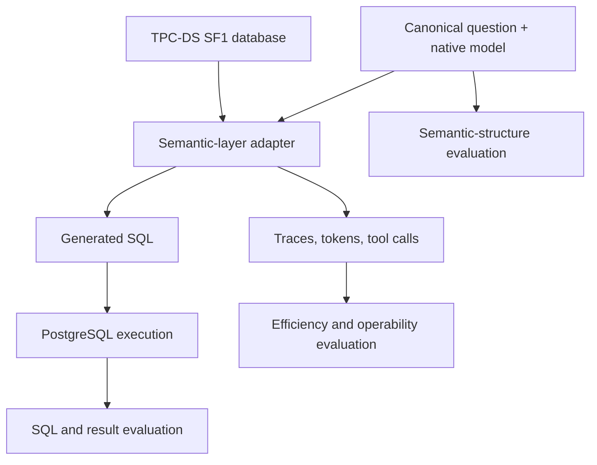

# Semantic Layer Benchmark

[English](README.md) | [简体中文](README.zh-CN.md)

A reproducible, observable benchmark for comparing semantic-layer systems on a shared TPC-DS-derived workload.

The project compares **MetricFlow, Cube, OKF, Ossie, and Skill**, with a DDL-only baseline. Every system receives the same database, semantic intent, and question set. The benchmark evaluates both the SQL each system produces and the semantic-model structure required to produce it.

> **Project status:** work in progress. The SF1 project scaffold, 99 canonical questions, source metadata, and PostgreSQL reference SQL are present. Runners, semantic-model implementations, and scoring logic have not been implemented yet.

## Benchmark scope

| Area | What is compared |
| --- | --- |
| SQL generation | Executability, result equivalence, referenced tables and columns, filters, joins, aggregations, and ordering |
| Semantic structure | Metric, measure, dimension, entity, relationship, time-grain, and reusable-definition coverage |
| Efficiency | End-to-end latency, model latency, input/output/cached tokens, and database execution time |
| Agent behavior | Tool calls, tool arguments, retries, failures, and generated artifacts |
| Operability | Trace completeness, error classification, reproducibility, and run-to-run stability |

The initial dataset scale is **TPC-DS SF1 only**. SF10 is deliberately out of scope for the current phase.

## Shared inputs

- **99 canonical questions:** one stable task ID from `q01` through `q99`.
- **103 PostgreSQL reference SQL files:** q14, q23, q24, and q39 each contain two formulations.
- **One common database:** PostgreSQL loaded from the same SF1 data manifest.
- **One semantic contract:** shared business concepts and relationships, represented separately in each system's native model format.
- **One observability contract:** the same run, token, tool-call, timing, and error fields across systems.

## How the benchmark works

Each run must pin the dataset manifest, question-set revision, semantic-model revision, system version, model configuration, and prompt configuration. This keeps comparisons attributable instead of mixing product changes with workload changes.

## Repository layout

| Path | Purpose |
| --- | --- |
| `benchmark/tpcds/questions/canonical/` | Canonical questions and per-question provenance |
| `benchmark/tpcds/sql/reference/postgres/` | Reviewable PostgreSQL reference SQL and its source chain |
| `benchmark/tpcds/sql/generated/` | SQL produced by each benchmark target |
| `data/tpcds/schema/postgres/` | PostgreSQL schema assets |
| `data/tpcds/sf1/` | SF1 manifests and local generated-data location |
| `semantic-models/` | Canonical contract and native models for each target |
| `runner/adapters/` | Target-specific execution adapters |
| `evaluators/` | SQL, result, and semantic-structure evaluation |
| `observability/` | OpenTelemetry, Phoenix, and trace artifacts |
| `runs/` | Run configurations and local run output |
| `reports/` | Benchmark reports and generated summaries |

Generated datasets, traces, run outputs, and generated reports are intentionally excluded from Git.

## Questions and SQL provenance

Every record in [`questions.jsonl`](benchmark/tpcds/questions/canonical/questions.jsonl) contains:

- the canonical question and symbolic parameters;
- the TPC-DS version and Appendix B section;
- the official toolkit template path;
- the local PostgreSQL SQL file or files;
- the pinned upstream repository, commit, path, URL, and licence.

The source chain is intentionally explicit:

1. **Business intent and numbering:** [TPC-DS v4.0.0 specification](https://www.tpc.org/tpc_documents_current_versions/pdf/tpc-ds_v4.0.0.pdf), Appendix B.
2. **Official functional definition:** `query_templates/queryN.tpl` from the [official TPC-DS v4.0.0 toolkit](https://www.tpc.org/TPC_Documents_Current_Versions/download_programs/tools-download-request5.asp?bm_type=TPC-DS&bm_vers=4.0.0&mode=CURRENT-ONLY).
3. **Reviewable PostgreSQL SQL:** TPC-DS-derived, fixed-parameter qualification SQL from a pinned Apache-2.0 upstream, adapted for PostgreSQL.

The official toolkit is distributed under the TPC EULA and is not vendored here. If the natural-language wording and SQL behavior differ, the official toolkit template is authoritative. See [`SOURCE.md`](benchmark/tpcds/sql/reference/postgres/SOURCE.md) and [`THIRD_PARTY_NOTICES.md`](THIRD_PARTY_NOTICES.md) for details.

## Data and toolkit

TPC-DS data files are generated locally with `dsdgen`; they are not committed to this repository.

1. Download the TPC-DS v4.0.0 tools from the [official TPC download page](https://www.tpc.org/TPC_Documents_Current_Versions/download_programs/tools-download-request5.asp?bm_type=TPC-DS&bm_vers=4.0.0&mode=CURRENT-ONLY).
2. Build the toolkit according to its included documentation.
3. Generate scale factor 1 data with `dsdgen -scale 1`.
4. Place generated `.dat` files under `data/tpcds/sf1/generated/` and record checksums and generator details under `data/tpcds/sf1/manifests/`.

The generated SF1 directory is Git-ignored because the data is reproducible and too large to review meaningfully in source control.

## Planned benchmark phases

1. **SQL evaluation:** give each system the same question and native semantic model, capture generated SQL, execute it on PostgreSQL, and compare results with the reference query.
2. **Structure evaluation:** compare how completely and faithfully each system represents the canonical metrics, dimensions, entities, joins, and time semantics.
3. **Operational evaluation:** compare latency, token usage, tool calls, retries, failures, trace completeness, and reproducibility.

## Current progress

- [x] SF1-only repository scaffold
- [x] 99 canonical questions with source metadata
- [x] 103 attributed PostgreSQL reference SQL files
- [ ] PostgreSQL schema and reproducible SF1 manifest
- [ ] Canonical semantic contract
- [ ] Native semantic models for all benchmark targets
- [ ] Runner and target adapters
- [ ] SQL/result/structure evaluators
- [ ] Observability schema and trace capture
- [ ] Reproducible benchmark report

## Licence and benchmark naming

The repository is licensed under [Apache License 2.0](LICENSE). Third-party material and attribution are documented in [`THIRD_PARTY_NOTICES.md`](THIRD_PARTY_NOTICES.md).

TPC, TPC-DS, TPC-H, and QphDS are trademarks of the Transaction Processing Performance Council. Workloads and measurements produced by this project must be described as **TPC-DS-derived** and not as audited or officially published TPC benchmark results.
