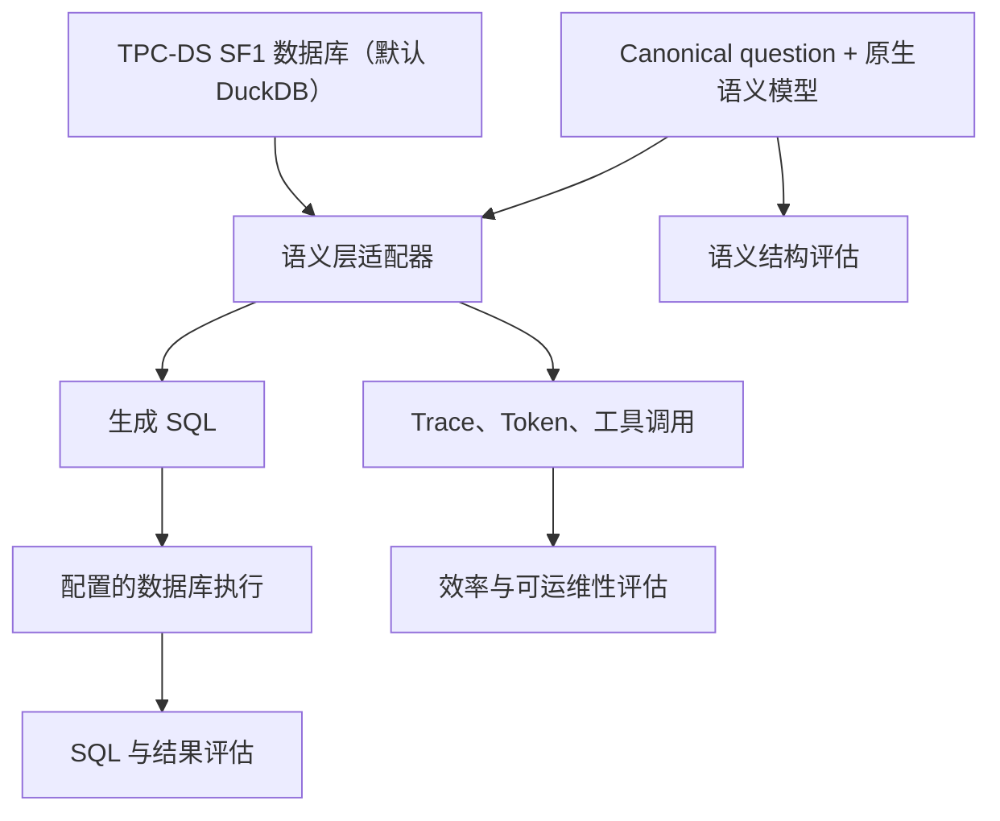

# 语义层基准测试

[English](README.md) | [简体中文](README.zh-CN.md)

这是一个基于统一 TPC-DS 派生工作负载，用于比较不同语义层系统的可复现、可观测基准测试项目。

项目计划比较 **MetricFlow、Cube、OKF、Ossie 和 Skill**，并加入仅提供 DDL 的基线。所有系统使用相同的数据库、业务语义和问题集，同时评估各系统生成的 SQL，以及生成这些 SQL 所依赖的语义模型结构。

> **项目状态：** 正在建设中。目前已经包含 SF1 项目骨架、99 个 canonical questions、PostgreSQL 参考 SQL，Skill、OKF、MetricFlow 和 Ossie 表级语义定义，以及第一版候选统一业务指标；其他被测系统模型、执行器和评分逻辑尚未实现。

## 评测范围

| 评测方向 | 对比内容 |
| --- | --- |
| SQL 生成 | SQL 可执行性、结果等价性、表与列引用、过滤、Join、聚合和排序 |
| 语义结构 | Metric、Measure、Dimension、Entity、Relationship、时间粒度及可复用定义的覆盖程度 |
| 效率 | 端到端耗时、模型耗时、输入/输出/缓存 Token 和数据库执行时间 |
| Agent 行为 | 工具调用、调用参数、重试、失败和生成产物 |
| 可运维性 | Trace 完整性、错误分类、可复现性和多次运行稳定性 |

初始数据规模仅使用 **TPC-DS SF1**，暂不包含 SF10。

## 统一输入

- **99 个 canonical questions：** 使用 `q01` 至 `q99` 的稳定题目编号。
- **103 个 PostgreSQL 参考 SQL：** q14、q23、q24 和 q39 各包含两种 SQL formulation。
- **一份可插拔数据库契约：** 默认使用 DuckDB，连接地址和 namespace 在运行时注入；所有系统使用同一份 SF1 manifest。
- **一份统一语义契约：** 公共业务概念和关系分别转换为各系统的原生语义模型。
- **一份统一可观测契约：** 所有系统记录相同的运行、Token、工具调用、耗时和错误字段。

## 已实现的语义模型

当前先建立统一的表级语义契约，再从问题集中整理统一业务指标：

- **Skill：** 面向 Agent 的 `SKILL.md`，按需渐进加载表和业务指标参考文档。
- **OKF：** 遵循 [Open Knowledge Format v0.2](https://github.com/GoogleCloudPlatform/knowledge-catalog/blob/main/okf/SPEC.md) 的知识包，包含表与指标 knowledge concepts。
- **MetricFlow：** standalone YAML 语义模型，包含 Entity、Dimension、Measure 和不会重名的基础 Metric。
- **Apache Ossie：** 通过 `0.2.0.dev0` schema 校验的 YAML 交换文档，包含 Dataset、Field、Relationship 和基础 Metric。
- **Canonical 指标：** 42 个基础指标族、25 个可复用派生指标、9 个 query-exact 公式，以及全部 99 个问题的映射。
- **覆盖范围：** 各原生格式在能力允许的范围内覆盖相同的 24 张 TPC-DS 业务表、425 个物理字段、106 条关系和 64 个可加度量输入。
- **语义内容：** 表粒度、主键、角色化 Join、字段角色、可空性和可加性规则。

格式映射、来源链、建模规则和当前限制见 [`semantic-models/README.zh-CN.md`](semantic-models/README.zh-CN.md)。

## 基准测试流程

每次运行必须固定数据集 manifest、问题集版本、语义模型版本、被测系统版本、模型配置和 Prompt 配置，避免把产品版本变化与工作负载变化混在一起。

## 目录结构

| 路径 | 用途 |
| --- | --- |
| `benchmark/tpcds/questions/canonical/` | Canonical questions 及逐题来源信息 |
| `benchmark/tpcds/sql/reference/postgres/` | 可审查的 PostgreSQL 参考 SQL 及来源链 |
| `benchmark/tpcds/sql/generated/` | 各被测系统生成的 SQL |
| `data/tpcds/schema/postgres/` | PostgreSQL 表结构文件 |
| `data/tpcds/sf1/` | SF1 manifest 和本地生成数据位置 |
| `semantic-models/` | 统一语义契约及各系统原生语义模型 |
| `runner/adapters/` | 各被测系统的运行适配器 |
| `runner/config/database.yaml` | 可插拔数据库连接、namespace、dialect 和安全策略 |
| `evaluators/` | SQL、结果和语义结构评估 |
| `observability/` | OpenTelemetry、Phoenix 和 Trace 产物 |
| `runs/` | 运行配置和本地运行结果 |
| `reports/` | 基准报告和生成的汇总结果 |

生成的数据集、Trace、运行结果和报告不会提交到 Git。

## 问题与 SQL 出处

[`questions.jsonl`](benchmark/tpcds/questions/canonical/questions.jsonl) 中的每条记录都包含：

- canonical question 和参数占位符；
- TPC-DS 版本与 Appendix B 章节；
- 官方工具包模板路径；
- 本地 PostgreSQL SQL 文件；
- 固定的上游仓库、commit、路径、URL 和许可证。

来源链被明确分为三层：

1. **业务意图和编号：** [TPC-DS v4.0.0 官方规范](https://www.tpc.org/tpc_documents_current_versions/pdf/tpc-ds_v4.0.0.pdf) Appendix B。
2. **官方功能定义：** [TPC-DS v4.0.0 官方工具包](https://www.tpc.org/TPC_Documents_Current_Versions/download_programs/tools-download-request5.asp?bm_type=TPC-DS&bm_vers=4.0.0&mode=CURRENT-ONLY)中的 `query_templates/queryN.tpl`。
3. **仓库内可审查 SQL：** 来自固定 Apache-2.0 上游并转换为 PostgreSQL 的、使用固定参数的 TPC-DS 派生 qualification SQL。

官方工具包受 TPC EULA 约束，因此不会直接复制进本仓库。当自然语言描述与 SQL 行为不一致时，以官方工具包中的模板为准。详细信息见 [`SOURCE.md`](benchmark/tpcds/sql/reference/postgres/SOURCE.md) 和 [`THIRD_PARTY_NOTICES.md`](THIRD_PARTY_NOTICES.md)。

## 数据与工具包

TPC-DS 数据通过 `dsdgen` 在本地生成，不会提交到仓库。

1. 从 [TPC 官方下载页面](https://www.tpc.org/TPC_Documents_Current_Versions/download_programs/tools-download-request5.asp?bm_type=TPC-DS&bm_vers=4.0.0&mode=CURRENT-ONLY)下载 TPC-DS v4.0.0 工具包。
2. 按工具包内文档完成编译。
3. 使用 `dsdgen -scale 1` 生成 SF1 数据。
4. 将生成的 `.dat` 文件放入 `data/tpcds/sf1/generated/`，并在 `data/tpcds/sf1/manifests/` 中记录校验和与生成器信息。

SF1 数据目录已加入 `.gitignore`，因为数据可以重复生成，而且不适合通过源码仓库审查。

## 计划中的评测阶段

1. **SQL 评估：** 向每个系统提供相同问题和原生语义模型，在配置的数据库中执行生成 SQL，并与对应方言参考查询的归一化结果比较。
2. **结构评估：** 对比各系统对统一 Metric、Dimension、Entity、Join 和时间语义的表达完整度与准确度。
3. **运行评估：** 对比耗时、Token、工具调用、重试、失败、Trace 完整性和可复现性。

## 当前进度

- [x] 仅包含 SF1 的仓库骨架
- [x] 99 个带来源信息的 canonical questions
- [x] 103 个带出处的 PostgreSQL 参考 SQL
- [x] 24 张业务表的 Skill、OKF、MetricFlow 和 Ossie 表语义
- [x] DuckDB 表结构、确定性加载器和可插拔只读连接适配器
- [ ] 包含表校验和与行数的 SF1 manifest
- [x] 从问题集反向整理的候选统一指标定义
- [ ] 已审核且补齐维度、粒度和 Join 的统一语义契约
- [ ] 所有被测系统的原生语义模型
- [ ] Runner 和系统适配器
- [ ] SQL、结果和结构评估器
- [ ] 可观测字段与 Trace 采集
- [ ] 可复现基准测试报告

## 许可证与基准名称

本仓库使用 [Apache License 2.0](LICENSE)。第三方材料和出处记录在 [`THIRD_PARTY_NOTICES.md`](THIRD_PARTY_NOTICES.md) 中。

TPC、TPC-DS、TPC-H 和 QphDS 是 Transaction Processing Performance Council 的商标。本项目生成的工作负载和结果必须表述为 **TPC-DS-derived（TPC-DS 派生）**，不能称为经过审计或正式发布的 TPC 基准结果。
