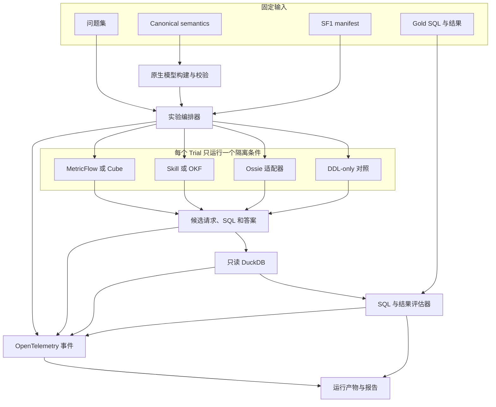
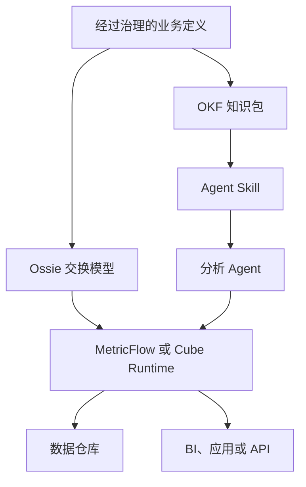

# 语义层基准测试

[English](README.md) | [简体中文](README.zh-CN.md)

这是一个可复现、可观测的基准测试项目，用于研究语义引擎、交换格式和 Agent 知识包在同一分析工作负载上如何影响准确性。

项目比较 **MetricFlow、Cube、Apache Ossie、Open Knowledge Format（OKF）和 Agent Skill**，并设置一个**仅提供 DDL 的对照组**。评测顺序是：先比较 SQL 与结果质量，再比较语义模型结构，同时在两个阶段中记录运行行为。

> **项目状态：** 正在建设中。初始工作负载是 TPC-DS 派生 SF1。目前仓库已经包含 99 个 canonical questions、103 份带出处的 PostgreSQL 参考 SQL formulation、DuckDB 表结构和加载器、q01-q10 DuckDB 参考 SQL、只读数据库适配器、候选统一指标契约，以及 Skill、OKF、MetricFlow 和 Ossie 的初始表示。Cube、端到端适配器、评估器和 Trace 采集仍处于计划阶段。下文会明确区分“已经实现”和“实验设计”。

## 这个基准要回答什么

本项目围绕五个问题设计：

1. 与 DDL-only 对照组相比，语义上下文能否提升结果执行准确率？
2. 错误发生在自然语言规划、语义建模、SQL 编译还是数据库执行环节？
3. 每种表示能否忠实表达相同的 Metric、Dimension、Join、Grain 和时间规则？
4. 按各自推荐方式使用时，耗时、Token、工具调用、重试和成本有什么差异？
5. 在真实生产架构里，哪些组件应该组合使用，而不是被当成互相替代的产品？

本基准**不会**假设五个对象属于同一种产品。

## 被测对象的真实角色

| 对象 | 主要角色 | 在本基准中的使用方式 | 是否原生生成 SQL |
| --- | --- | --- | --- |
| MetricFlow | Metric 编译器和语义查询引擎 | Agent 生成 Metric 请求；MetricFlow 校验语义图并编译 SQL | 是 |
| Cube | 语义层服务和查询 API | Agent 发现可用成员，再向 Cube 服务提交 REST 或 Semantic SQL 请求 | 是 |
| Apache Ossie | 语义模型交换规范 | Validator 和参考适配器加载 Ossie 文档；Agent 消费模型，互操作能力单独测试 | 不假设存在独立运行时 |
| OKF | 可移植知识表示 | 统一 Retriever 向同一个 SQL Agent 提供相关 Markdown Concept | 否 |
| Skill | Agent 工作流和渐进式上下文 | Agent 激活 `SKILL.md`，按需加载引用知识，然后编写 SQL | 否 |
| DDL-only | 对照条件 | 同一个 Agent 只获得物理 DDL 和问题 | 由 Agent 直接编写 |

因此，MetricFlow 和 Cube 可以在原生语义运行时赛道对比；Skill 和 OKF 可以在 Agent 知识传递赛道对比；Ossie 主要作为可移植模型评测，端到端测试必须明确适配器名称。不适用或不支持的能力分别记录为 `not_applicable` 或 `unsupported`，不能静默计零分。

## 统一基准契约

初始工作负载仅为 **TPC-DS-derived SF1**，SF10 暂不进入当前范围。

| 契约 | 固定输入 |
| --- | --- |
| 工作负载 | `q01` 至 `q99` 共 99 个稳定任务 ID |
| 参考逻辑 | 103 份 SQL formulation；q14、q23、q24 和 q39 各有两份可接受实现 |
| 数据 | 一份 SF1 快照，以及行数、校验和、生成器版本和 manifest hash |
| 数据库 | 默认 DuckDB 1.4.0，通过可插拔连接契约以只读方式打开 |
| 语义 | 一份系统无关的 Dataset、Metric、Dimension、Join、Grain、时间角色和计算规则目录 |
| Agent | 同一赛道内固定模型、Prompt 外壳、工具策略、上下文预算、重试策略和生成参数 |
| 可观测 | 统一的 Run、Trace、Token、工具调用、耗时、产物和错误字段 |

工作负载本身是可插拔的。未来可以增加企业 SaaS 工作负载包——数据 manifest、问题、参考结果和 canonical semantics——而不改评估器及被测对象适配器的契约。

## 基准测试架构



Gold SQL、预期结果和 question-to-metric map 只允许评估器访问，被测对象永远不能看到。每次 Trial 只暴露当前问题、允许使用的物理 Schema、对应原生语义表示和声明过的工具。

## 实验赛道

一个总榜会掩盖对象之间的本质差异，因此项目按赛道发布结果，并为每个赛道报告一组指标。

| 阶段与赛道 | 回答的问题 | 参与对象 | 输出 |
| --- | --- | --- | --- |
| Phase 1A：受控 context-to-SQL | 当运行时保持一致时，各种表示中的信息本身是否有帮助？ | 五种对象加 DDL-only | 同一个 Agent 在统一 Retriever 和相同证据预算下生成 DuckDB SQL |
| Phase 1B：原生端到端 | 按照每种对象的预期方式使用，实际效果如何？ | 五种对象加 DDL-only | 原生请求、可观测的生成 SQL 和最终结果 |
| Phase 1C：原生 Serving | 确定性语义编译和 Serving 的开销如何？ | 仅 MetricFlow 和 Cube | 编译或服务结果、冷/热耗时及引擎诊断 |
| Phase 2：语义结构 | Canonical 契约被表达得多完整、多准确？ | 五种语义对象 | Coverage、Fidelity manifest 和原生校验结果 |
| Phase 3：运行表现 | 使用了多少资源，出现了什么失败？ | 所有适用的 Phase 1 Trial | Trace、Token、工具、重试、耗时、错误及估算成本 |

### 受控 context-to-SQL 赛道

这是最接近苹果对苹果的消融实验。所有表示都转换成带出处的 `SemanticEvidence` Chunk，统一使用同一个 Retriever、检索上限、Token 预算、Agent 模型和 Prompt。Agent 直接生成 DuckDB SQL；MetricFlow 和 Cube 在这个赛道不参与编译。这样测到的是语义信息表达效果，而不是原生引擎能力。

### 原生端到端赛道

该赛道比较实际使用效果，而不是强制相同接口：

- MetricFlow：Agent 选择 Metric、Dimension、Filter 和时间范围，再由 MetricFlow 编译 SQL。
- Cube：Agent 查询模型元数据，然后调用 Cube Query API 或 Semantic SQL。
- Skill：Agent 激活 Skill，只按需加载相关指令和 Concept。
- OKF：Agent 浏览 Bundle Index 和检索到的 Concept，然后编写 SQL。
- Ossie：参考适配器向同一个 Agent 暴露已校验模型，由 Agent 编写 SQL。若通过其他引擎执行，必须作为单独的互操作变体。
- DDL-only：同一个 Agent 在没有增强语义上下文的情况下直接编写 SQL。

这个赛道回答的是“实际采用该对象会发生什么”，不能被解释为纯文件格式对比。

## 每个对象怎么使用

| 对象 | 被测产物 | 适配器接口 | 谁生成 SQL | 常见应用 |
| --- | --- | --- | --- | --- |
| MetricFlow | 原生 semantic-model 和 metric YAML | Metric/Dimension 发现及 Compile/Query 命令 | Agent 规划后由 MetricFlow 编译 | 治理统一指标及可复用维度查询 |
| Cube | Cube YAML 或 JavaScript Data Model | `/v1/meta`、`/v1/load` 或 Semantic SQL | Cube Runtime | BI、嵌入式分析和 Agent 的语义 API |
| Ossie | 包含 Dataset、Field、Relationship 和 Metric 的完整 YAML 文档 | Schema Validator 和基准参考 Loader | 默认由参考 Agent；互操作变体除外 | 在兼容工具之间迁移语义模型 |
| OKF | 带 YAML Frontmatter 和 Index 的 Markdown Concept | 统一 Search/Retrieval 工具 | 参考 Agent | 可移植业务上下文、出处和整理后的知识 |
| Skill | `SKILL.md` 及可选 Reference 和 Script | 原生激活及渐进式文件读取 | 参考 Agent | 可重复执行的 Agent 指令和特定任务知识 |

Ossie 只有一个 YAML 文件并不表示只有一张表。其官方结构中，顶层 Semantic Model 是完整模型容器，内部的 `datasets` 集合才承载逻辑事实表和维表。

## 一次 Trial 如何运行

1. 解析并记录工作负载、数据 manifest、仓库、模型、Prompt、Adapter 和被测版本的固定值。
2. 只启动一个隔离的被测条件，并通过 Health Check 和原生模型校验。
3. 选择问题，但不暴露参考 SQL、参考结果和 Canonical 问题映射。
4. 启动 Root Trace，并执行该赛道统一的超时、重试、上下文和工具策略。
5. 允许 Agent 检索上下文或调用对象，记录原生请求、工具调用序列和可观测 SQL。
6. 拒绝写操作及问题契约之外的多语句 SQL，再对同一份只读 DuckDB 快照执行。
7. 统一类型、列顺序规则、行顺序、浮点容差和 Null，再与参考结果比较。
8. 使用同一个 `run_id` 和 `trial_id` 保存脱敏 Trace、产物、结果 Hash、错误分类和评分。

## 公平性与有效性规则

- **相同语义：** 所有原生模型必须由 Canonical Contract 转换而来，任何对象都不能获得其他对象没有的额外业务事实。
- **禁止 Gold 泄漏：** 参考 SQL、参考结果、评分规则及 question-to-metric map 位于被测沙箱之外。
- **同赛道使用同一模型：** 固定 Provider、模型修订版、Temperature、支持时的 Seed、Prompt 外壳、最大输出和重试策略。
- **相同证据预算：** 受控检索使用同一 Chunker、Top-k 和 Token Cap，并记录实际检索证据。
- **按能力使用原生接口：** 原生 Adapter 可以暴露对象预期提供的接口，但接口及所有工具调用必须被记录。
- **只读执行：** 被测对象不能修改数据库，凭证和敏感环境变量不能进入 Prompt 或 Trace。
- **缓存分离：** 正确性 Run 不使用结果缓存；冷启动、进程热态和引擎缓存必须作为独立场景。
- **资源隔离：** 初期顺序运行耗时实验，固定 CPU、内存、超时和镜像 Digest；Warm-up Trial 不进入耗时汇总。
- **重复实验：** 默认设计为每个问题、每个条件独立运行三次；随机化并记录对象及问题顺序。
- **显式限制：** 原生校验失败、不支持的语义、Adapter Fallback 和 Query-layer Workaround 必须公开。

## 评测方法

### Phase 1：SQL 与结果质量

结果等价是首要正确性指标，因为结构不同的 SQL 可能完全等价。SQL 文本是否相同只作为诊断信息。

| 指标 | 含义 |
| --- | --- |
| Execution accuracy | 归一化候选结果与可接受的参考结果一致 |
| SQL execution rate | 候选 SQL 能在策略范围内完成 Parse、Bind 和 Execute |
| Semantic component accuracy | 表、字段、Join、Filter、Aggregation、Group、Order 和 Limit 行为正确 |
| Native-plan accuracy | 编译前，Agent 选择了正确的 Metric、Dimension、Filter 和时间角色 |
| Answer completeness | 返回题目要求的全部输出；q14、q23、q24 和 q39 仍使用一个问题级分母 |
| Stability | 同一问题和条件在重复 Trial 中的结果一致程度 |

### Phase 2：语义结构质量

结构评估器按 Canonical ID 比较原生产物，记录：

- Dataset、Field、Dimension、Entity、Relationship 和角色化 Join 覆盖；
- Base、Derived、Cumulative、Ratio 和 Query-exact Metric 覆盖；
- 事实 Grain、Aggregation Time、Dimension Reachability、Additivity、Null 和除零规则一致性；
- Native Expression、Query-layer Workaround 和 Unsupported 状态；
- 原生 Parser、Schema 和 Semantic Validation 结果；
- 出处、文档、复用性及机器可发现性信号。

报告发布明细数量和每项能力覆盖率，不把它们隐藏在一个主观总分中。

### 统计方法

- 准确率差异按问题配对，报告点估计、95% 置信区间，以及满足假设时的配对显著性检验。
- 耗时、Token、工具调用和成本报告 Median、p95 和分布，不能只报告平均值。
- 按问题复杂度、Join 数量、Metric 类型、渠道，以及逻辑是否可原生表达分层分析。
- `not_applicable` 不进入分母，并单独展示。

## 可观测契约

每个 Trial 产生一个 Root Span，并在适用时包含 `context.retrieve`、`llm.generate`、`tool.call`、`semantic.compile`、`db.execute` 和 `evaluate` 子事件或 Span。

| 类别 | 必填字段 |
| --- | --- |
| 身份 | `run_id`、`trial_id`、`question_id`、Target、Lane、Repetition、时间戳 |
| 可复现 | 仓库 SHA、工作负载修订版、Manifest SHA-256、原生模型 SHA-256、Adapter 版本、镜像 Digest |
| 模型用量 | Provider、模型修订版、生成参数、Prompt Hash、Provider 返回的 Input/Output/Cached Token |
| 工具用量 | 有序工具名、脱敏参数、结果元数据、状态、耗时和重试关联 |
| 语义工作 | 检索到的 Concept ID、原生请求、编译状态、Fallback 或 Workaround 标记 |
| SQL 工作 | 生成 SQL 产物、语句策略、执行耗时、行数和结果 Hash |
| 错误 | 阶段、统一分类、原生错误码、是否可重试、脱敏消息 |
| 成本 | 在存在固定价格快照时记录模型、目标服务和数据库成本 |

不记录原始秘密信息，不请求或推断 Provider 隐藏的推理内容。Provider 没有返回的用量字段应记录为 unavailable，而不能静默估算。

## 执行环境

第一版可复现环境以本地运行和 DuckDB 为核心：

| 组件 | 基准环境 | 状态 |
| --- | --- | --- |
| 编排器与评估器 | Linux、Python 3.11+、固定仓库 Revision | Runner 骨架已有，编排尚待实现 |
| 数据库 | DuckDB 1.4.0，SF1 文件只读挂载 | Schema、Loader 和只读 Adapter 已有 |
| MetricFlow | 固定 standalone commit `8750c1d`；Adapter 选择 DuckDB SQL Renderer | 表语义已有，可执行 Adapter 待实现 |
| Cube | 固定 Cube 镜像、隔离服务、官方 DuckDB Data Source；正确性 Run 关闭 Cache | 原生模型和 Adapter 待实现 |
| Skill | 与其他知识条件相同的参考 Agent；Package 挂载到临时 Repo Skill 位置 | 表和 Metric 知识已有，Harness 集成待实现 |
| OKF | 相同参考 Agent 和统一确定性 Retriever | 表和 Metric Bundle 已有，Retrieval Adapter 待实现 |
| Ossie | 固定 Schema Validator 和基准参考 Loader | 模型已通过 Schema 校验，Runtime Adapter 待实现 |
| Telemetry | OpenTelemetry 兼容 Collector 和本地 Trace；Phoenix 为可选查看器 | 待实现 |

Cube 官方支持本地 DuckDB 数据库路径。固定版本的 MetricFlow 源码包含 DuckDB SQL Renderer，因此计划中的 Adapter 可以编译 DuckDB SQL，再交给统一 Runner 执行。但本项目不会宣称所有当前 dbt 产品部署都正式支持 DuckDB；发布结果前，固定版本必须通过可执行兼容性 Gate。

数据库仍通过 `BENCHMARK_DATABASE_URL`、Catalog、Schema 和 Dialect 配置保持可插拔。只有全部被比较的执行路径使用同一数据快照和逻辑关系契约时，替换数据库才有效。PostgreSQL 参考 SQL 只是公式和结果 Oracle；PostgreSQL 不是默认运行环境。

## 本地准备

TPC-DS 数据通过官方工具包在本地生成，不提交到仓库。

```bash
python -m venv .venv
source .venv/bin/activate
pip install -e '.[test]'
```

1. 从 [TPC 官方下载页面](https://www.tpc.org/TPC_Documents_Current_Versions/download_programs/tools-download-request5.asp?bm_type=TPC-DS&bm_vers=4.0.0&mode=CURRENT-ONLY)下载 TPC-DS v4.0.0 工具包。
2. 编译工具包并运行 `dsdgen -scale 1`。
3. 将生成的 `.dat` 文件放到 `data/tpcds/sf1/generated/`。
4. 创建数据库和可复现 Manifest：

```bash
python scripts/load_tpcds_sf1.py
pytest -q
```

默认 URL 为 `duckdb:///./data/tpcds/sf1/tpcds.duckdb`。覆盖规则见 [`runner/config/README.zh-CN.md`](runner/config/README.zh-CN.md) 和 [`.env.example`](.env.example)。q01-q10 当前已通过 Parse、Bind 和空 Schema 执行检查；在生成数据 Manifest 之前，SF1 结果等价仍是独立的待完成 Gate。

## 实际应用方式

在真实系统里，这五个对象通常是互补关系：



- 核心需求是确定性 Metric 编译和统一 Serving 接口时，选择 MetricFlow 或 Cube。
- 核心需求是模型交换、导入导出或迁移时，选择 Ossie，并为它配套执行引擎。
- 业务上下文、出处和知识需要在人与 Agent 之间可读、可移植时，选择 OKF。
- Agent 需要明确“何时、如何查找并应用知识”的可重复步骤时，选择 Skill。
- 常见生产组合是**执行引擎 + 交换模型 + 知识包 + Skill**，而不是寻找一个覆盖所有角色的赢家。

## 仓库结构

| 路径 | 用途 |
| --- | --- |
| `benchmark/tpcds/questions/canonical/` | Canonical questions 和逐题出处 |
| `benchmark/tpcds/sql/reference/duckdb/` | DuckDB 参考转换及校验状态 |
| `benchmark/tpcds/sql/reference/postgres/` | 带出处的 PostgreSQL 公式/参考 SQL |
| `benchmark/tpcds/sql/generated/` | 每个对象和 Trial 生成的 SQL |
| `data/tpcds/schema/duckdb/` | DuckDB 物理 Schema |
| `data/tpcds/sf1/` | 生成的 SF1 数据库、Manifest 和本地数据目录 |
| `semantic-models/canonical/` | 系统无关的语义和指标契约 |
| `semantic-models/{target}/` | 每个对象的原生表示 |
| `runner/config/` | 可插拔数据库和未来实验配置 |
| `runner/adapters/` | 计划中的被测对象 Adapter 边界 |
| `evaluators/` | 计划中的 SQL、结果和结构评估器 |
| `observability/` | 计划中的 Telemetry 配置和脱敏 Trace |
| `runs/` | Run Spec 和本地运行输出 |
| `reports/` | 生成的基准报告 |

生成数据、Trace、Run 输出和报告均不会提交到 Git。

## 问题与 SQL 出处

[`questions.jsonl`](benchmark/tpcds/questions/canonical/questions.jsonl) 的每条记录包含 canonical question、符号化参数、TPC-DS 版本和 Appendix B 章节、官方模板路径、本地参考 SQL，以及固定上游来源和许可证。

来源优先级为：

1. [TPC-DS v4.0.0 规范](https://www.tpc.org/tpc_documents_current_versions/pdf/tpc-ds_v4.0.0.pdf) Appendix B，用于确定业务意图和编号。
2. [TPC-DS v4.0.0 官方工具包](https://www.tpc.org/TPC_Documents_Current_Versions/download_programs/tools-download-request5.asp?bm_type=TPC-DS&bm_vers=4.0.0&mode=CURRENT-ONLY)中的 `query_templates/queryN.tpl`，用于确定功能定义。
3. 固定的 Apache-2.0、TPC-DS 派生 PostgreSQL SQL，作为可审查的固定参数参考。
4. 在同一份生成 SF1 快照上完成验证的 DuckDB 转换，作为可执行结果 Oracle。

官方工具包受 TPC EULA 约束，因此仅链接而不直接复制。详情见 [`SOURCE.md`](benchmark/tpcds/sql/reference/postgres/SOURCE.md) 和 [`THIRD_PARTY_NOTICES.md`](THIRD_PARTY_NOTICES.md)。

## 当前进度

- [x] 仅包含 SF1 的仓库骨架
- [x] 99 个 canonical questions 和 103 份带出处的 PostgreSQL reference formulation
- [x] 候选 Canonical Metric 及 q01-q99 映射
- [x] Skill 和 OKF 表及 Metric 知识
- [x] MetricFlow 和 Ossie 表语义及 Base Metric Coverage
- [x] DuckDB Schema、确定性 Loader 和只读可插拔 Adapter
- [x] 带明确校验级别的 q01-q10 DuckDB SQL
- [ ] 含行数及校验和的生成 SF1 Manifest
- [ ] q11-q99 DuckDB 参考 SQL 和 SF1 结果等价
- [ ] 完成审核的 Canonical Dimension、Grain、Join 和 Metric 语义
- [ ] Cube 原生语义模型
- [ ] 原生及受控 Context Adapter
- [ ] SQL/Result 和 Structure Evaluator
- [ ] OpenTelemetry 事件 Schema 和 Trace 采集
- [ ] 重复运行的基准报告

## 后续实现顺序

1. 固化上文描述的 Experiment Run Schema 和 Observability Schema。
2. 生成一份 SF1 Manifest，并在 DuckDB 上验证参考结果。
3. 先完成 DDL-only Adapter，建立对照执行路径。
4. 增加 Cube，并完成 MetricFlow、Skill、OKF 和 Ossie Adapter。
5. 先实现 Phase 1 执行/结果评测，再实现 Phase 2 结构评分。
6. 先运行 q01-q10 小规模 Pilot，完成错误复盘后再扩展至全部 99 题。

## 官方格式和运行时资料

- [MetricFlow 概览](https://docs.getdbt.com/docs/build/about-metricflow)和[命令说明](https://docs.getdbt.com/docs/build/metricflow-commands)
- [Cube 语义层架构](https://docs.cube.dev/docs/introduction)、[REST API](https://docs.cube.dev/reference/core-data-apis/rest-api)和[DuckDB 数据源](https://docs.cube.dev/admin/connect-to-data/data-sources/duckdb)
- [Apache Ossie Core Semantic Model Specification](https://github.com/apache/ossie/blob/c109cf5b0a06970a97599e8f7c2a72859822a3a4/core-spec/spec.md)
- [Open Knowledge Format v0.2 Specification](https://github.com/GoogleCloudPlatform/knowledge-catalog/blob/main/okf/SPEC.md)
- [OpenAI 关于 Agent Skill 和 Progressive Disclosure 的文档](https://developers.openai.com/codex/skills)

## 许可证与基准名称

本仓库使用 [Apache License 2.0](LICENSE)。第三方材料和出处记录在 [`THIRD_PARTY_NOTICES.md`](THIRD_PARTY_NOTICES.md)。

TPC、TPC-DS、TPC-H 和 QphDS 是 Transaction Processing Performance Council 的商标。本项目产生的工作负载和结果必须表述为 **TPC-DS-derived（TPC-DS 派生）**，不能称为经过审计或正式发布的 TPC 基准结果。
