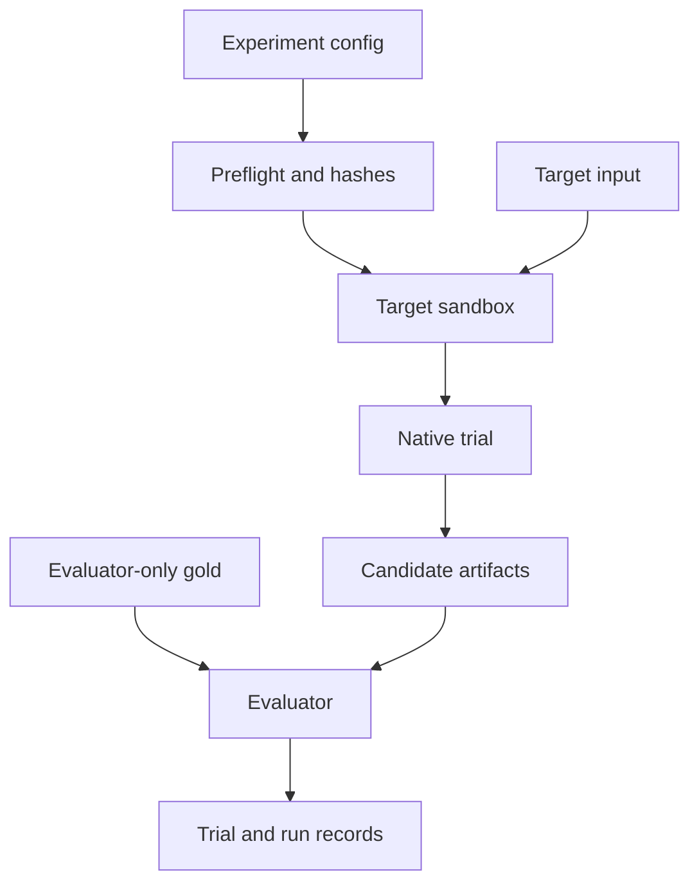

# Experiment and observability contracts

[English](README.md) | [简体中文](README.zh-CN.md)

These versioned contracts separate orchestration, target-visible inputs, native execution, evaluator-only gold assets, and reporting. They define the wire and artifact shapes before an adapter implementation can influence the experiment.

## Files

| Contract | Producer | Consumer | Purpose |
| --- | --- | --- | --- |
| [`experiment.schema.json`](experiment.schema.json) | Experiment author | Runner preflight | Immutable run plan, target set, budgets, isolation, and artifact policy |
| [`dataset-manifest.schema.json`](dataset-manifest.schema.json) | SF1 loader | Runner preflight | Generator, schema, table, row-count, file-hash, and snapshot identity |
| [`question-instance.schema.json`](question-instance.schema.json) | Workload curator | Prompt renderer and evaluator | Materialized user question separated from evaluator-only SQL and comparison rules |
| [`trace-event.schema.json`](trace-event.schema.json) | Runner and adapters | Trace store and report builder | Ordered, sanitized lifecycle and usage events |
| [`trial-record.schema.json`](trial-record.schema.json) | Trial orchestrator and evaluator | Run aggregator | One question × target × repetition outcome |
| [`run-record.schema.json`](run-record.schema.json) | Run aggregator | Report builder | Reproducibility envelope and trial summary |

All contracts use JSON Schema Draft 2020-12 and start at schema version `0.1.0`. A schema version changes only with a documented migration; the experiment's `protocol_revision` changes whenever behavior changes without altering the record shape.

## Native-first invariant

The primary lane is `native_end_to_end`. The runner may wrap a native call to add IDs, timeouts, sanitization, and telemetry, but it may not flatten target artifacts into a common evidence representation.

| Target | Native unit preserved by the contract |
| --- | --- |
| MetricFlow | Self-hosted MetricFlow discovery, validation, and metric query operations |
| Cube | Live Cube service, `/v1/meta`, and one declared query API variant |
| Ossie | Original schema-conformant Ossie YAML document |
| OKF | Original Markdown files, YAML frontmatter, indexes, and links |
| Skill | Host discovery metadata, activation, full `SKILL.md`, then on-demand references |
| DDL-only | Original physical DuckDB DDL |
| Blank context | DuckDB's catalog discovery and read-only SQL surface, with no preloaded schema |

The optional `controlled_context_ablation` lane is allowed only as a separately named secondary experiment. It must never be mixed into the native leaderboard or presented as native system behavior.

## Visibility boundary

A question instance contains three explicit compartments:

- `target_input` is the only question data that may enter the agent conversation. It contains only the fully rendered question.
- `orchestrator_only` records typed parameter bindings used to materialize and reproduce that question. It is not sent to the model because an identifier-valued parameter could leak a physical column name.
- `evaluator_only` contains reference SQL, expected statement count, comparison rules, and provenance. It is opened only after the target has submitted a final result.

The runner must build the target sandbox from an allowlist rather than mounting the repository root. Prompt files, declared native artifacts, and target-specific tools are visible. Canonical metric mappings, SQL directories, result oracles, other targets, reports, and previous run directories are not.



## Trial identity and lifecycle

One trial is exactly one materialized question instance × one target condition × one repetition. A new conversation is mandatory for every trial. Suggested deterministic IDs are:

```text
run_id   = <experiment_id>-<UTC timestamp>-<config hash prefix>
trial_id = <run_id>-<question_id>-<target>-r<repetition>
```

The runner applies this state order:

1. Resolve environment references without serializing secret values.
2. Hash the repository revision, experiment, dataset manifest, native artifact, prompts, and exposed tool schemas.
3. Fail preflight if a question has unresolved placeholders, a required version is unpinned, a target is not healthy, or native validation fails.
4. Construct a target-specific allowlisted sandbox and start a fresh conversation.
5. Record every native operation and database operation in sequence.
6. Accept exactly one final `benchmark.submit_result` call.
7. Close the target sandbox before loading evaluator-only assets.
8. Evaluate result equivalence and emit the immutable trial record.

There is no cross-trial message state. Provider-side prompt caching may occur only if the selected scenario permits it and the provider reports it; cached tokens are recorded separately.

## Failure and unsupported semantics

Native limitations are results, not reasons to silently switch paths. If MetricFlow or Cube cannot express a question, the trial is `unsupported` with `error_category: unsupported_semantics`. If a model or runtime fails native validation, it is `invalid`. A direct-SQL or query-layer workaround is a different explicitly registered condition.

Missing tools, missing materialized questions, missing database manifests, mutable version references, and unresolved environment pins fail before any billable agent call. Timeouts and native service errors remain distinct from wrong results.

A local development manifest may omit the `dsdgen` binary hash, but publication preflight requires it. `dataset_sha256` is derived from the physical schema hash plus sorted table row counts and source-file hashes, so timestamps, local paths, and database serialization do not change the logical snapshot identity.

## Required artifacts

An implementation writes content-addressed or immutable files under the configured run directory:

```text
runs/<run_id>/
  run.json
  resolved-experiment.yaml
  environment.json
  trials/<trial_id>/
    trial.json
    trace.jsonl
    conversation.sanitized.jsonl
    native-requests/
    sql/
    results/
```

Raw result rows are disabled by default. Candidate and reference result hashes use the same deterministic normalization. Native request bodies, generated SQL, and sanitized tool errors remain reviewable.

## Pilot and 99-question expansion

[`../config/native-sf1-q01.yaml`](../config/native-sf1-q01.yaml) selects only q01 and `blank_context` so the runner contract can be proven before adapters are added. It is intentionally not evidence about semantic-layer quality.

Before the full benchmark can run, q01–q99 need reviewed materialized instances conforming to `question-instance.schema.json`. Multi-statement templates q14, q23, q24, and q39 stay one question-level trial with two result handles. The other templates require exactly one result handle. Every target receives the identical rendered question; the orchestrator and evaluator compartments never enter the model or native service.

## Source-aligned native operations

The operation registry follows the official interfaces rather than inventing a universal semantic API:

- [MetricFlow commands](https://docs.getdbt.com/docs/build/metricflow-commands) define native discovery, validation, and query operations.
- [Cube REST API](https://docs.cube.dev/reference/core-data-apis/rest-api) defines `/v1/meta` and `/v1/load`; other Cube query interfaces are separate variants.
- [OKF v0.2](https://github.com/GoogleCloudPlatform/knowledge-catalog/blob/main/okf/SPEC.md) is consumed as directly readable Markdown with YAML frontmatter and links, because the format deliberately requires no special runtime.
- [Ossie core specification](https://github.com/apache/ossie/blob/c109cf5b0a06970a97599e8f7c2a72859822a3a4/core-spec/spec.md) defines the native document being consumed, not an assumed query service.
- [OpenAI Skill documentation](https://learn.chatgpt.com/docs/build-skills) defines metadata-first discovery and full instruction loading on activation.
