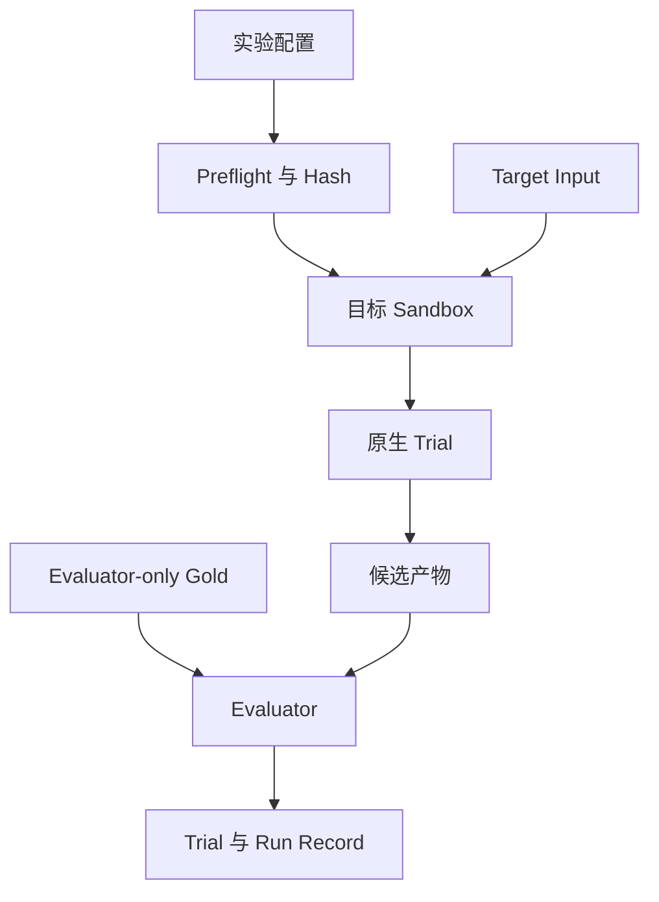

# 实验与可观测契约

[English](README.md) | [简体中文](README.zh-CN.md)

这些带版本的契约将调度、目标可见输入、原生执行、Evaluator-only Gold 和报告相互隔离。在实现 Adapter 之前，先固定线上消息和产物的数据结构，避免 Adapter 反过来改变实验。

## 文件

| 契约 | 生产者 | 消费者 | 作用 |
| --- | --- | --- | --- |
| [`experiment.schema.json`](experiment.schema.json) | 实验作者 | Runner Preflight | 固定运行计划、目标集合、预算、隔离和产物策略 |
| [`dataset-manifest.schema.json`](dataset-manifest.schema.json) | SF1 Loader | Runner Preflight | 固定 Generator、Schema、表、行数、文件 Hash 和快照身份 |
| [`question-instance.schema.json`](question-instance.schema.json) | Workload 维护者 | Prompt Renderer 与 Evaluator | 将实例化用户问题与仅评测可见的 SQL、比较规则分开 |
| [`gold-result.schema.json`](gold-result.schema.json) | 数据冻结工具 | Evaluator Preflight | 与数据集绑定且不持久化结果行的参考结果身份 |
| [`trace-event.schema.json`](trace-event.schema.json) | Runner 与 Adapter | Trace Store 与报告生成器 | 有序且脱敏的生命周期与用量事件 |
| [`trial-record.schema.json`](trial-record.schema.json) | Trial Orchestrator 与 Evaluator | Run Aggregator | 一个问题 × 一个目标 × 一次重复的结果 |
| [`run-record.schema.json`](run-record.schema.json) | Run Aggregator | 报告生成器 | 可复现性 Envelope 与 Trial 汇总 |

全部契约使用 JSON Schema Draft 2020-12，初始 Schema 版本为 `0.1.0`。只有提供迁移说明时才能变更 Schema 版本；如果行为发生变化但记录结构不变，则更新实验的 `protocol_revision`。

## Native-first 不变量

主赛道是 `native_end_to_end`。Runner 可以在原生调用外增加 ID、超时、脱敏和 Telemetry，但不能将目标产物扁平化为统一 Evidence 表示。

| 目标 | 契约必须保留的原生单元 |
| --- | --- |
| MetricFlow | Self-hosted MetricFlow 的发现、校验和指标查询操作 |
| Cube | 实际 Cube 服务、`/v1/meta` 和一个明确声明的查询 API 变体 |
| Ossie | 符合 Schema 的原始 Ossie YAML 文档 |
| OKF | 原始 Markdown、YAML Frontmatter、Index 和链接 |
| Skill | 宿主先发现 Metadata，再激活完整 `SKILL.md`，最后按需读取引用 |
| DDL-only | 原始 DuckDB 物理 DDL |
| 空白上下文 | 不预加载 Schema，只使用 DuckDB Catalog 发现和只读 SQL 接口 |

可选的 `controlled_context_ablation` 只能作为单独命名的次要消融实验，不能混进原生榜单，也不能被描述成系统的原生行为。

## 可见性边界

问题实例明确分成三个区域：

- `target_input` 是唯一允许进入 Agent 对话的问题数据，只包含完全渲染后的问题。
- `orchestrator_only` 保存用于实例化和复现问题的强类型参数绑定，但不会发送给模型，因为 Identifier 类型的参数可能泄漏物理列名。
- `evaluator_only` 包括参考 SQL、预期语句数、比较规则和出处，只能在目标完成最终提交后打开。

Runner 必须通过 Allowlist 构建目标 Sandbox，不能直接挂载整个仓库。Prompt、已声明原生产物和目标专属工具可以进入；Canonical 指标映射、SQL 目录、结果 Oracle、其他目标、报告和历史 Run 目录都不可见。



## Trial 身份与生命周期

一个 Trial 严格等于一个实例化问题 × 一个目标条件 × 一次重复。每个 Trial 必须新建对话。建议使用下面的确定性 ID：

```text
run_id   = <experiment_id>-<UTC timestamp>-<config hash prefix>
trial_id = <run_id>-<question_id>-<target>-r<repetition>
```

Runner 按照以下状态顺序执行：

1. 解析环境变量引用，但不能把密钥值序列化。
2. 计算仓库 Revision、实验、数据 Manifest、原生产物、Prompt 和实际 Tool Schema 的 Hash。
3. 如果问题仍有占位符、必要版本未锁定、目标不健康或原生校验失败，则 Preflight 失败。
4. 创建目标专属 Allowlist Sandbox，并启动全新对话。
5. 按顺序记录每一次原生操作和数据库操作。
6. 只接受一次最终 `benchmark.submit_result` 调用。
7. 关闭目标 Sandbox 后才能加载 Evaluator-only 产物。
8. 评测结果一致性并写出不可变 Trial Record。

不同 Trial 之间没有消息状态。只有在当前场景允许且 Provider 能报告的情况下，才能使用 Provider Prompt Cache；Cached Token 必须单独记录。

## Failure 与 Unsupported Semantics

原生能力限制本身就是实验结果，不能静默切换执行路径。如果 MetricFlow 或 Cube 无法表达某个问题，Trial 状态为 `unsupported`，错误类别为 `unsupported_semantics`。如果模型或 Runtime 无法通过原生校验，则状态为 `invalid`。直接 SQL 或 Query-layer Workaround 必须注册成另一个明确条件。

缺少工具、实例化问题、数据库 Manifest、不可变版本引用或环境 Pin 时，必须在产生任何付费 Agent 调用前失败。Timeout、原生服务错误和结果错误需要分别统计。

本地开发 Manifest 可以暂时不记录 `dsdgen` Binary Hash，但发布结果前的 Preflight 必须要求该字段。`dataset_sha256` 根据物理 Schema Hash、排序后的表行数和源文件 Hash 计算，因此时间戳、本地路径和数据库文件序列化不会改变逻辑快照身份。

Gold Result Identity 会把数据 Manifest、数据库 Hash、实例化问题和参考 SQL 绑定到标准化结果的列名、行数及 SHA-256。它不包含结果行，并且始终只对 Evaluator 可见；只有全部快照检查通过后才能重新生成。

## 必需产物

实现需要在配置的 Run 目录下写入内容寻址或不可变文件：

```text
runs/<run_id>/
  run.json
  resolved-experiment.yaml
  environment.json
  trials/<trial_id>/
    trial.json
    trace.jsonl
    conversation.sanitized.jsonl
    native-requests/
    sql/
    results/
```

默认不保存原始结果行。候选与参考结果 Hash 必须采用完全相同的确定性归一化逻辑。原生 Request Body、生成 SQL 和脱敏后的工具错误需要保持可 Review。

## Pilot 与 99 题扩展

[`../config/native-sf1-q01.yaml`](../config/native-sf1-q01.yaml) 只选择 q01 和 `blank_context`，用于在增加 Adapter 前证明 Runner 契约可行。它本身不能作为语义层质量证据。

完整基准运行前，q01–q99 都需要经过 Review 的实例化问题，并符合 `question-instance.schema.json`。多语句模板 q14、q23、q24 和 q39 仍然是一个问题级 Trial，但包含两个 Result Handle；其他模板只能包含一个。所有目标接收完全相同的渲染问题；Orchestrator 和 Evaluator 区域永远不能进入模型或原生服务。

## 与官方来源一致的原生操作

操作注册表依据官方入口，而不是发明一个通用语义 API：

- [MetricFlow 命令](https://docs.getdbt.com/docs/build/metricflow-commands)定义原生发现、校验和查询操作。
- [Cube REST API](https://docs.cube.dev/reference/core-data-apis/rest-api)定义 `/v1/meta` 和 `/v1/load`；其他 Cube 查询接口属于独立变体。
- [OKF v0.2](https://github.com/GoogleCloudPlatform/knowledge-catalog/blob/main/okf/SPEC.md)直接消费 Markdown、YAML Frontmatter 和链接，因为该格式明确不要求专用 Runtime。
- [Ossie Core Specification](https://github.com/apache/ossie/blob/c109cf5b0a06970a97599e8f7c2a72859822a3a4/core-spec/spec.md)定义需要消费的原生文档，而不是假设存在一个查询服务。
- [OpenAI Skill 文档](https://learn.chatgpt.com/docs/build-skills)定义先暴露 Metadata，激活后加载完整指令的流程。
