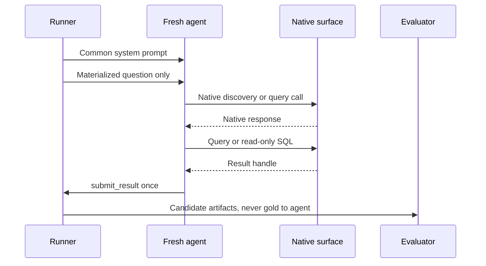

# Native agent conversation protocol

[English](README.md) | [简体中文](README.zh-CN.md)

The primary benchmark starts one fresh agent conversation for every question instance, target, and repetition. The same provider, model revision, system prompt, user-message template, generation settings, timeout, and turn budget are pinned within a comparable agent-bearing lane. Only the target's native artifact exposure and native tool surface change.

## “Blank context” has a precise meaning

`blank_context` means **zero preloaded data or semantic context**. It does not mean an empty API request. The model still receives:

1. the common system prompt;
2. one fully materialized user question;
3. generic schemas for its allowed tools; and
4. the results of tools it chooses to call.

It receives no DDL, table names, column names, sample rows, business definitions, metrics, target identity, reference SQL, expected result, canonical question-to-metric map, prior messages, or retrieved documents at conversation start. It may discover the physical database using `db.list_relations` and `db.describe_relations`, then use `db.execute_readonly`. This measures what an agent can do from native database discovery alone.

`ddl_only` is a different control. It receives the physical DuckDB DDL but no enriched business semantics. Results for these two baselines must never be combined.

## Message sequence

The runner creates a new provider conversation rather than continuing a previous response ID. It does not send correction messages, schema hints, metric suggestions, or “try again” prompts. Tool errors are returned verbatim after secret and path sanitization; self-repair inside the fixed budget is part of the measurement.

The user message is rendered from [`native-agent-user.md`](native-agent-user.md) with one substitution: `{{question}}`. Unresolved placeholders such as `<YEAR>` fail preflight. Presentation requirements that affect correctness—columns, grouping, order, and limit—must already be stated in the materialized question.

## Native exposure by target

| Condition | Initial exposure | Permitted path to an answer |
| --- | --- | --- |
| `blank_context` | Nothing semantic | DuckDB catalog discovery → agent SQL |
| `ddl_only` | Physical DDL | Agent SQL |
| `metricflow` | MetricFlow native discovery | MetricFlow native query |
| `cube` | Cube `/v1/meta` | Cube `/v1/load` in the REST variant |
| `ossie` | Original validated Ossie YAML | Agent SQL using the native specification artifact |
| `okf` | Bundle index | Direct Markdown/frontmatter/link navigation → agent SQL |
| `skill` | Skill name and description | Host activation → full `SKILL.md` → referenced files on demand → agent SQL |

Observability wrappers may time, identify, sanitize, and persist a native call. They must not rewrite its semantic content or translate every target into common text chunks. The exact operation allowlists are in [`../config/targets.native.yaml`](../config/targets.native.yaml).

The blank-context model sees the exact closed tool definitions in [`../tools/blank-context.tools.json`](../tools/blank-context.tools.json). Their descriptions expose physical capabilities only and contain no TPC-DS table names, join hints, metric definitions, or examples derived from gold SQL.

## Conversation artifacts

The sanitized transcript records ordered system, user, assistant, and tool messages; stable tool-call IDs; exact exposed tool schemas; provider response IDs when available; token usage; native requests and responses; generated SQL; tool errors; and the final submission. Secrets, credentials, private chain-of-thought, and raw result rows are excluded. Large payloads are stored as content-addressed artifacts and referenced by path and SHA-256.

[`../examples/blank-context-q01.transcript.yaml`](../examples/blank-context-q01.transcript.yaml) illustrates the envelope and tool sequence. It is not an executed result and intentionally omits candidate SQL and result rows.

## The other 98 questions

Canonical questions contain symbolic inputs, but an agent trial always uses a materialized instance. Every q01–q99 instance must:

- replace every symbolic placeholder with a declared typed value;
- include output details that affect result equivalence;
- keep reference SQL and comparison rules under `evaluator_only`;
- declare one or two expected statements—only q14, q23, q24, and q39 may form two-statement groups; and
- pass source, license, and provenance checks before execution.

The committed q01 instance is the contract pilot. Expanding it to q01–q99 is a separate reviewed data task; missing instances are preflight failures, not skipped successes.
