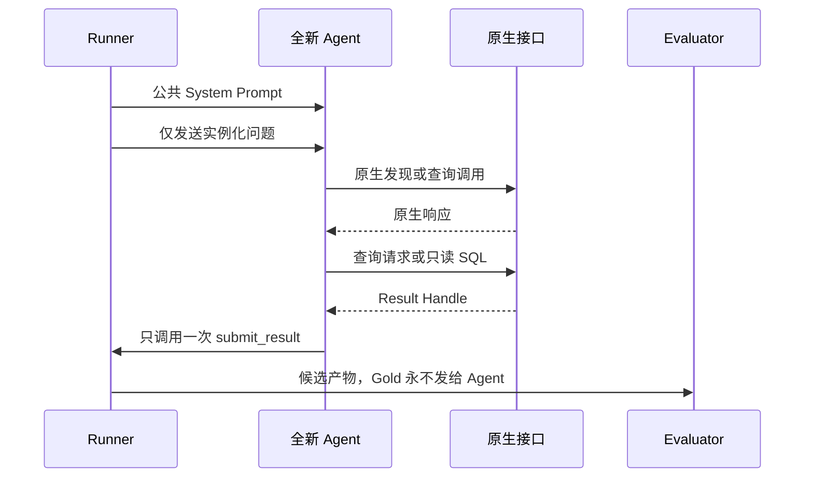

# 原生 Agent 对话协议

[English](README.md) | [简体中文](README.zh-CN.md)

主基准针对每个问题实例、目标和重复次数启动一段全新的 Agent 对话。在可以比较的 Agent 赛道内，Provider、模型版本、System Prompt、用户消息模板、生成参数、超时和最大轮数全部固定；唯一变化的是目标的原生产物暴露方式和原生工具面。

## “空白上下文”的精确定义

`blank_context` 表示**没有预加载任何数据或语义上下文**，并不表示 API 请求里一个 Token 都没有。模型仍会收到：

1. 公共 System Prompt；
2. 一条已经完成参数实例化的用户问题；
3. 当前允许调用的通用工具 Schema；
4. 它主动调用工具后返回的结果。

对话开始时，它看不到 DDL、表名、列名、样例行、业务定义、指标、被测目标名称、参考 SQL、预期结果、Canonical 问题指标映射、历史消息或检索文档。它可以通过 `db.list_relations` 和 `db.describe_relations` 自己发现物理数据库，再调用 `db.execute_readonly`。该基线衡量的是 Agent 仅依靠数据库原生发现能力可以做到什么。

`ddl_only` 是另一个对照组：它可以看到 DuckDB 物理 DDL，但没有增强业务语义。两种基线的结果绝不能合并。

## 消息顺序

Runner 会新建 Provider Conversation，而不是延续上一个 Response ID。它不会发送纠错消息、Schema 提示、指标建议或“再试一次”的 Prompt。工具错误经过密钥和路径脱敏后原样返回；Agent 在固定预算内自行修复属于被测能力。

用户消息由 [`native-agent-user.md`](native-agent-user.md) 渲染，只允许替换 `{{question}}`。如果还存在 `<YEAR>` 一类占位符，Preflight 直接失败。影响正确性的列、分组、排序和 Limit 必须已经写进实例化后的问题。

## 各目标的原生暴露方式

| 条件 | 初始暴露 | 得到答案的允许路径 |
| --- | --- | --- |
| `blank_context` | 不提供任何语义 | DuckDB Catalog 发现 → Agent SQL |
| `ddl_only` | 物理 DDL | Agent SQL |
| `metricflow` | MetricFlow 原生发现 | MetricFlow 原生查询 |
| `cube` | Cube `/v1/meta` | REST 变体使用 Cube `/v1/load` |
| `ossie` | 原始且通过校验的 Ossie YAML | Agent 基于原生规范产物编写 SQL |
| `okf` | Bundle Index | 直接浏览 Markdown、Frontmatter 和链接 → Agent SQL |
| `skill` | Skill 名称和描述 | 宿主激活 → 完整 `SKILL.md` → 按需读取引用 → Agent SQL |

可观测 Wrapper 可以计时、标识、脱敏并保存原生调用，但不能改写其语义内容，也不能把全部目标转换成统一文本 Chunk。准确的操作白名单见 [`../config/targets.native.yaml`](../config/targets.native.yaml)。

空白上下文模型实际看到的封闭工具定义见 [`../tools/blank-context.tools.json`](../tools/blank-context.tools.json)。这些 Description 只说明物理能力，不包含 TPC-DS 表名、Join 提示、Metric 定义或从 Gold SQL 提取的示例。

## 对话产物

脱敏 Transcript 会保存有序的 System、User、Assistant 和 Tool 消息，稳定的 Tool Call ID，实际暴露的工具 Schema，可获得的 Provider Response ID，Token 用量，原生请求与响应，生成 SQL，工具错误和最终提交。密钥、凭据、私有思维链和原始结果行不会保存。大型 Payload 作为内容寻址产物保存，Transcript 只记录路径与 SHA-256。

[`../examples/blank-context-q01.transcript.yaml`](../examples/blank-context-q01.transcript.yaml) 展示了消息 Envelope 和工具顺序。它不是实际实验结果，因此有意省略候选 SQL 和结果行。

## 其余 98 个问题

Canonical 问题包含符号参数，但 Agent Trial 必须使用完成实例化的问题。q01–q99 的每个实例都必须：

- 用已声明的强类型值替换全部符号占位符；
- 在问题中写清影响结果一致性的输出要求；
- 将参考 SQL 和比较规则保留在 `evaluator_only`；
- 声明预期的一条或两条语句，只有 q14、q23、q24 和 q39 可以组成双语句组；
- 执行前通过出处、许可证和 Provenance 检查。

当前提交的 q01 是契约 Pilot。将其扩展到 q01–q99 是一项需要单独 Review 的数据任务；缺少实例必须记为 Preflight Failure，不能算作跳过后成功。
