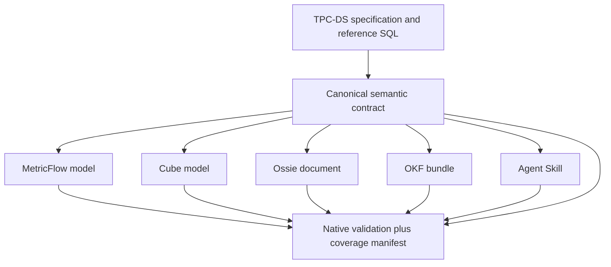

# Semantic models

[English](README.md) | [简体中文](README.zh-CN.md)

This directory contains the system-neutral semantic contract and each benchmark target's native representation. Every target starts from the same business intent. Differences in the result must come from representational or runtime capabilities—not from giving one target better definitions.

The default execution database is DuckDB. PostgreSQL reference SQL and the original physical DDL remain attributed source material, not a requirement that every native model run on PostgreSQL.

## Model architecture

The canonical layer is the comparison oracle. Targets receive only their native representation during a benchmark trial; they do not receive canonical answer mappings or reference SQL.

## These representations have different roles

| Representation | Category | Native consumption model | Benchmark role |
| --- | --- | --- | --- |
| MetricFlow | Executable metric compiler | Query metrics and dimensions; compile or execute generated SQL | Native runtime plus context-normalized comparison |
| Cube | Executable semantic service | Query model metadata, REST/GraphQL, or Semantic SQL | Native runtime plus context-normalized comparison |
| Ossie | Semantic interchange specification | Validate, import, translate, or expose through an adapter | Structure, interoperability, and agent-consumption comparison |
| OKF v0.2 | Portable knowledge representation | Navigate indexed Markdown concepts with YAML metadata | Retrieval and agent-context comparison |
| Skill | Agent workflow package | Activate `SKILL.md` and progressively read references | Native agent-workflow and context comparison |

OKF and Skill are not treated as SQL engines. Ossie is not assigned an invented standalone query engine. This distinction is part of the methodology, not a disadvantage to hide.

## Current implementation status

| Representation | Location | Current state |
| --- | --- | --- |
| Canonical | [`canonical/tpcds-sf1/`](canonical/tpcds-sf1/) | Candidate metric catalog and q01-q99 mapping present |
| MetricFlow | [`metricflow/tpcds-sf1/`](metricflow/tpcds-sf1/) | 24 table models, entities, dimensions, base measures, and capability map present |
| Cube | [`cube/`](cube/) | Planned; no native model should be inferred from the placeholder |
| Ossie | [`ossie/tpcds-sf1/`](ossie/tpcds-sf1/) | One schema-validated complete model document and capability map present |
| OKF v0.2 | [`okf/tpcds-sf1/`](okf/tpcds-sf1/) | Table and candidate metric concepts present |
| Skill | [`skill/tpcds-sf1-table-semantics/`](skill/tpcds-sf1-table-semantics/) | `SKILL.md`, table references, and candidate metric references present |
| DDL-only | [`ddl-only/`](ddl-only/) | Planned control representation |

Skill, OKF, MetricFlow, and Ossie currently describe the same 24 business tables and 425 physical columns. MetricFlow and Ossie include 64 additive or semi-additive measure inputs. Ossie carries 106 explicit relationships; MetricFlow represents equivalent join paths with entities. The canonical inventory contains 42 base metric families, 25 derived metrics, 9 query-exact formulas, and mappings for all 99 questions.

These numbers describe checked-in coverage, not end-to-end benchmark completion.

## Canonical-to-native mapping

| Canonical concept | MetricFlow | Cube | Ossie | OKF | Skill |
| --- | --- | --- | --- | --- | --- |
| Dataset and grain | Semantic model and relation | Cube/view and source SQL | Dataset, source, primary key | Table concept and schema section | Table reference |
| Field and dimension | Dimension expression | Dimension | Field expression and dimension metadata | Structured Markdown schema | Structured table guidance |
| Entity and join | Primary/unique/foreign entity | Join between cubes | Explicit relationship with ordered keys | Linked concepts plus join prose | Role-specific join instructions |
| Base aggregation | Measure and simple metric | Measure | Aggregate metric expression | Metric concept or attested computation | Metric reference and formula |
| Derived metric | Derived/ratio/cumulative metric where supported | Calculated measure or view member | Metric expression where portable | Linked metric concept | Reusable metric instruction |
| Time semantics | Time dimension and aggregation time | Time dimension and rolling/time-shift semantics | Typed field plus dialect expression | Metric/table business rule | Explicit time-role selection rule |
| AI guidance | Descriptions exposed through adapter | Descriptions and AI context | `ai_context` | Human- and agent-readable body | Trigger and progressive workflow |
| Native validation | Parser and semantic validator | Cube compile/health check | Ossie JSON Schema validator | OKF conformance checks | Skill package validation |

The mapping table is conceptual. A cell does not claim that every canonical metric is already implemented or natively expressible.

## Native usage contract

### MetricFlow

- Validate the pinned standalone YAML before a trial.
- Let the agent discover available metrics and dimensions through the adapter.
- Accept a structured request containing metrics, group-bys, filters, ordering, and time bounds.
- Compile with the pinned MetricFlow DuckDB renderer.
- Execute the emitted SQL through the shared read-only database runner, so result normalization remains common.
- Record planning time, compile time, emitted SQL, validation output, and fallback status separately.

Official MetricFlow documentation describes the semantic graph and SQL construction model, and its CLI can expose generated SQL through compile/explain commands. This repository pins an older standalone authoring form; current dbt model-embedded YAML is not assumed to be interchangeable.

### Cube

- Start an isolated, version-pinned Cube service connected to the same local DuckDB file.
- Compile and health-check the model before a trial.
- Allow the agent to inspect `/v1/meta` and submit a JSON query to `/v1/load`, or use a separately named Semantic SQL variant.
- Disable query-result caching and pre-aggregations for correctness runs.
- Measure cold start, warm process, and cached serving only as separate performance scenarios.
- Capture the semantic request, generated SQL when available, API retries such as continuation waits, and final data.

Cube documents native DuckDB file support and standard REST, GraphQL, SQL, and metadata interfaces. The Cube model is not implemented in this repository yet.

### Apache Ossie

- Validate the entire document against the pinned `0.2.0.dev0` schema.
- Treat the top-level semantic model as a complete container; its `datasets` array contains all fact and dimension datasets.
- In the controlled context lane, normalize the document into the same evidence chunks used for every representation.
- In the native end-to-end lane, expose the model through the benchmark reference loader and let the reference agent write SQL.
- Run import into a compatible engine only as an explicitly labeled interoperability variant.

Ossie structure coverage and interoperability are primary results. It is not penalized for lacking an independent serving runtime.

### Open Knowledge Format

- Validate required YAML frontmatter and internal indexes.
- Start at `index.md`, retrieve matching table or metric concepts, and follow relevant links within the fixed evidence budget.
- Use the same retriever implementation as the other controlled-context conditions.
- Let the reference agent write DuckDB SQL from the retrieved knowledge.
- Record concept IDs, source paths, retrieval ranks, token counts, and broken-link behavior.

OKF v0.2 intentionally prescribes a portable Markdown-plus-frontmatter corpus rather than storage, serving, or query infrastructure. The adapter supplies retrieval; OKF itself is not credited with generating SQL.

### Agent Skill

- Mount the package in an isolated repository skill location for the trial.
- Expose only the Skill name and description initially.
- On activation, load the complete `SKILL.md`; load references progressively according to the instructions.
- Let the same reference agent generate DuckDB SQL.
- Record whether activation was explicit or implicit and every reference read.

Official OpenAI documentation describes Skills as instruction/resource/script packages and uses progressive disclosure: initial metadata is visible first, then the complete `SKILL.md` is loaded when selected. The native Skill lane preserves this behavior; the controlled-context lane removes activation behavior to isolate content quality.

## Structure evaluation contract

Every canonical item receives one target-specific status:

| Status | Meaning |
| --- | --- |
| `native` | Expressed and validated using the target's documented construct |
| `adapter` | Preserved losslessly by a declared adapter, but not by the native artifact alone |
| `query_layer` | Must be supplied at query time rather than as a reusable model object |
| `unsupported` | Cannot be represented faithfully in the pinned version |
| `not_applicable` | The capability is outside the target category, such as SQL serving for OKF |

Coverage reports must keep those statuses separate. A query-layer workaround cannot be presented as native support, and `not_applicable` is excluded from the denominator.

The evaluator checks:

- exact canonical IDs and source datasets;
- physical and business grain;
- primary, unique, foreign, role-playing, and composite relationships;
- dimension reachability without fact-to-fact fanout;
- base aggregation, derived expression, filters, null behavior, and division-by-zero behavior;
- default and alternative time roles;
- additive, non-additive, and semi-additive rules;
- native parser, schema, semantic, or package validation;
- provenance and machine-discoverability metadata.

## Controlled-context normalization

For the Phase 1A comparison, every format is transformed into immutable evidence records containing:

- `evidence_id` and target;
- source path and canonical IDs represented;
- content text without generated answers;
- provenance and native validation state;
- deterministic chunk order and token count.

The same chunker, search index, top-k, tie-breaking rule, and token cap are used for every target. Retrieval output is part of the trace. Reference SQL, expected results, question-to-metric mappings, and evaluator annotations are never indexed.

## Database and namespace resolution

Canonical semantics name logical datasets only. Catalog, schema, relation quoting, and dialect expressions are rendered by the deployment or adapter from [`runner/config/database.yaml`](../runner/config/database.yaml).

The current MetricFlow table models still contain the earlier `tpcds.public.<table>` mappings and PostgreSQL Julian-date expressions. They are valid source artifacts but are **not yet the executable DuckDB deployment**. The MetricFlow adapter must render DuckDB relations and date expressions, validate the rendered project, and record its hash before an execution result can be published.

Cube can use its documented local DuckDB path. Skill, OKF, and the Ossie reference-agent path do not connect to the database themselves; their generated SQL is executed by the shared read-only runner.

## Shared modeling rules

- Preserve the physical fact-table grain before aggregation.
- Join through declared surrogate keys; never infer joins from similar descriptive names.
- Keep sold, shipped, returned, billing, and refunded roles distinct even when they point to the same dimension.
- Aggregate each fact before broad cross-fact comparisons to avoid fanout.
- Sum transaction-line quantities and extended amounts only when their additivity contract allows it.
- Do not sum unit prices or unit costs; use a justified average or weighted calculation.
- Treat inventory quantity on hand as semi-additive and never sum it across snapshot dates.
- Encode null and zero-denominator behavior explicitly for reusable ratios.
- Do not promote a query-specific ranking, window, or predicate into a reusable metric without a reviewed business definition.

## Source chain

1. **Logical model and terminology:** [TPC-DS v4.0.0 specification](https://www.tpc.org/tpc_documents_current_versions/pdf/tpc-ds_v4.0.0.pdf).
2. **Physical source schema:** [PostgreSQL DDL pinned at commit `63ee712`](https://github.com/litkhai/tpcds-scripts/blob/63ee7120a89ba5d1c5d8287f98c8e8c427768c98/engines/postgres/ddl/schema.sql), retained with attribution and adapted to the local DuckDB schema.
3. **MetricFlow:** [standalone source pinned at `8750c1d`](https://github.com/dbt-labs/metricflow/tree/8750c1dfe79c9d92e37fc9b8542d544e29f8852e) and [current official behavior](https://docs.getdbt.com/docs/build/about-metricflow).
4. **Cube:** [official modeling architecture](https://docs.cube.dev/docs/introduction), [REST API](https://docs.cube.dev/reference/core-data-apis/rest-api), and [DuckDB setup](https://docs.cube.dev/admin/connect-to-data/data-sources/duckdb).
5. **Ossie:** [pinned core specification and schema](https://github.com/apache/ossie/tree/c109cf5b0a06970a97599e8f7c2a72859822a3a4).
6. **OKF:** [Open Knowledge Format v0.2 specification](https://github.com/GoogleCloudPlatform/knowledge-catalog/blob/main/okf/SPEC.md).
7. **Skill:** [official OpenAI Skills documentation](https://developers.openai.com/codex/skills).

This project is TPC-DS-derived and is not an audited TPC benchmark. The TPC toolkit and generated SF1 data are not vendored.

## Current boundary

The artifacts are intentionally asymmetric at this stage:

- Skill and OKF include the complete candidate metric catalog.
- MetricFlow and Ossie include table semantics, base inputs, and capability maps; remaining native metrics still require implementation and validation.
- Cube is not modeled yet.
- Canonical names, grains, dimension reachability, and query-exact formulas still require review.
- No end-to-end target adapter or structure evaluator has been completed.

Benchmark results may be published only after the workload manifest, rendered native model, target pin, and applicable validation gates are all recorded.
