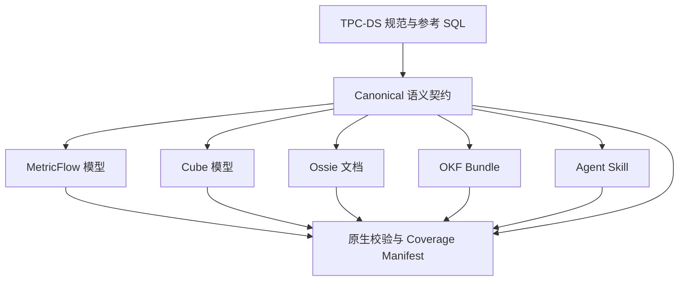

# 语义模型

[English](README.md) | [简体中文](README.zh-CN.md)

本目录保存系统无关的语义契约和每个被测对象的原生表示。所有对象都从相同业务意图出发，结果差异只能来自表示方式或运行时能力，不能来自某个对象获得了更好的定义。

默认执行数据库是 DuckDB。PostgreSQL 参考 SQL 和原始物理 DDL 继续作为带出处的源材料保留，但不要求所有原生模型都在 PostgreSQL 上运行。

## 模型架构

Canonical 层是结构比较的 Oracle。Benchmark Trial 只向被测对象提供它的原生表示，不提供 Canonical 答案映射或参考 SQL。

## 不同表示承担不同角色

| 表示 | 类型 | 原生消费方式 | 基准角色 |
| --- | --- | --- | --- |
| MetricFlow | 可执行 Metric 编译器 | 查询 Metric 和 Dimension，再编译或执行 SQL | 原生运行时及标准化上下文对比 |
| Cube | 可执行语义服务 | 查询模型元数据、REST/GraphQL 或 Semantic SQL | 原生运行时及标准化上下文对比 |
| Ossie | 语义交换规范 | 校验、导入、转换，或通过 Adapter 暴露 | 结构、互操作和 Agent 消费对比 |
| OKF v0.2 | 可移植知识表示 | 浏览带 YAML 元数据的索引化 Markdown Concept | Retrieval 和 Agent Context 对比 |
| Skill | Agent 工作流包 | 激活 `SKILL.md` 并渐进读取 Reference | 原生 Agent 工作流及 Context 对比 |

OKF 和 Skill 不会被当成 SQL 引擎。Ossie 也不会被强行绑定一个并不存在的独立 Query Engine。这是方法设计的一部分，而不是需要隐藏的劣势。

## 当前实现状态

| 表示 | 位置 | 当前状态 |
| --- | --- | --- |
| Canonical | [`canonical/tpcds-sf1/`](canonical/tpcds-sf1/) | 候选 Metric Catalog 和 q01-q99 映射已有 |
| MetricFlow | [`metricflow/tpcds-sf1/`](metricflow/tpcds-sf1/) | 24 个表模型、Entity、Dimension、基础 Measure 和 Capability Map 已有 |
| Cube | [`cube/`](cube/) | 计划中；不能从占位文件推断已有原生模型 |
| Ossie | [`ossie/tpcds-sf1/`](ossie/tpcds-sf1/) | 一份通过 Schema 校验的完整模型文档和 Capability Map 已有 |
| OKF v0.2 | [`okf/tpcds-sf1/`](okf/tpcds-sf1/) | 表和候选 Metric Concept 已有 |
| Skill | [`skill/tpcds-sf1-table-semantics/`](skill/tpcds-sf1-table-semantics/) | `SKILL.md`、表 Reference 和候选 Metric Reference 已有 |
| DDL-only | [`ddl-only/`](ddl-only/) | 对照表示计划中 |

Skill、OKF、MetricFlow 和 Ossie 当前描述相同的 24 张业务表和 425 个物理字段。MetricFlow 和 Ossie 包含 64 个可加或半可加基础输入。Ossie 保存 106 条显式 Relationship，MetricFlow 通过 Entity 表达等价 Join Path。Canonical Inventory 包含 42 个 Base Metric Family、25 个 Derived Metric、9 个 Query-exact Formula 和全部 99 题的映射。

这些数字只表示仓库内已有覆盖，不表示端到端 Benchmark 已经完成。

## Canonical 到原生格式的映射

| Canonical Concept | MetricFlow | Cube | Ossie | OKF | Skill |
| --- | --- | --- | --- | --- | --- |
| Dataset 与 Grain | Semantic Model 和 Relation | Cube/View 和 Source SQL | Dataset、Source、Primary Key | Table Concept 和 Schema Section | Table Reference |
| Field 与 Dimension | Dimension Expression | Dimension | Field Expression 和 Dimension Metadata | 结构化 Markdown Schema | 结构化表指导 |
| Entity 与 Join | Primary/Unique/Foreign Entity | Cube 之间的 Join | 带有序 Key 的显式 Relationship | Concept Link 加 Join 文本 | 角色化 Join 指令 |
| Base Aggregation | Measure 和 Simple Metric | Measure | Aggregate Metric Expression | Metric Concept 或 Attested Computation | Metric Reference 和 Formula |
| Derived Metric | 支持时使用 Derived/Ratio/Cumulative Metric | Calculated Measure 或 View Member | 可移植时使用 Metric Expression | 互相链接的 Metric Concept | 可复用 Metric 指令 |
| 时间语义 | Time Dimension 和 Aggregation Time | Time Dimension 及 Rolling/Time Shift | Typed Field 和 Dialect Expression | Metric/Table 业务规则 | 显式时间角色选择规则 |
| AI 指导 | Adapter 暴露 Description | Description 和 AI Context | `ai_context` | 人与 Agent 均可读的 Body | Trigger 和渐进工作流 |
| 原生校验 | Parser 和 Semantic Validator | Cube Compile/Health Check | Ossie JSON Schema Validator | OKF Conformance Check | Skill Package Validation |

此表是概念映射，不代表每个 Canonical Metric 已实现或可以原生表达。

## 原生使用契约

### MetricFlow

- Trial 开始前校验固定版本的 standalone YAML。
- Agent 通过 Adapter 发现可用 Metric 和 Dimension。
- 接收包含 Metric、Group-by、Filter、Order 和时间范围的结构化请求。
- 使用固定版本的 MetricFlow DuckDB Renderer 编译。
- 将输出 SQL 交给统一只读数据库 Runner 执行，以共享结果归一化逻辑。
- 分别记录规划耗时、编译耗时、输出 SQL、校验结果和 Fallback 状态。

MetricFlow 官方文档说明了 Semantic Graph 和 SQL Construction 模型，CLI 也可以通过 Compile/Explain 查看生成 SQL。本仓库固定的是较早的 standalone 编写格式，不能假设它与当前 dbt 的 Model-embedded YAML 可直接互换。

### Cube

- 启动连接同一本地 DuckDB 文件、固定版本且隔离的 Cube 服务。
- Trial 前编译模型并通过 Health Check。
- Agent 可以读取 `/v1/meta`，再向 `/v1/load` 提交 JSON Query；Semantic SQL 作为另一个明确命名的变体。
- 正确性 Run 关闭 Query Result Cache 和 Pre-aggregation。
- 冷启动、进程热态和缓存 Serving 仅作为独立性能场景测试。
- 记录 Semantic Request、可获得时的生成 SQL、Continuation Wait 等 API 重试及最终数据。

Cube 官方文档明确支持本地 DuckDB 文件及 REST、GraphQL、SQL 和 Metadata 接口。当前仓库尚未实现 Cube 模型。

### Apache Ossie

- 使用固定的 `0.2.0.dev0` Schema 校验完整文档。
- 将顶层 Semantic Model 视为完整容器；`datasets` 数组包含所有事实和维度 Dataset。
- 受控 Context 赛道将文档转换成与其他表示相同的 Evidence Chunk。
- 原生端到端赛道通过 Benchmark Reference Loader 暴露模型，再由参考 Agent 编写 SQL。
- 只有明确标记为 Interoperability Variant 时，才允许将其导入兼容引擎执行。

Ossie 的核心结果是结构覆盖和互操作性。它不会因为缺少独立 Serving Runtime 而被扣分。

### Open Knowledge Format

- 校验必填 YAML Frontmatter 和内部 Index。
- 从 `index.md` 开始，检索匹配的表或 Metric Concept，并在固定证据预算内跟随相关链接。
- 与其他受控 Context 条件使用相同 Retriever。
- 由参考 Agent 根据检索知识编写 DuckDB SQL。
- 记录 Concept ID、源路径、检索排名、Token 数和 Broken Link 行为。

OKF v0.2 的目标是规定可移植 Markdown 加 Frontmatter Corpus，而不是规定 Storage、Serving 或 Query Infrastructure。Adapter 负责检索；不能把 SQL 生成归功于 OKF 本身。

### Agent Skill

- 将 Package 挂载到隔离的临时 Repository Skill 位置。
- 初始只暴露 Skill 名称和 Description。
- 激活后完整加载 `SKILL.md`，再根据指令渐进加载 Reference。
- 由同一个参考 Agent 生成 DuckDB SQL。
- 记录显式或隐式激活方式，以及每一次 Reference Read。

OpenAI 官方文档将 Skill 定义为包含指令、资源和可选 Script 的 Package，并采用 Progressive Disclosure：初始只提供元数据，被选择后再完整读取 `SKILL.md`。原生 Skill 赛道保留这个行为；受控 Context 赛道移除激活差异，只比较内容质量。

## 结构评测契约

每个 Canonical Item 在每个对象下只能获得一种状态：

| 状态 | 含义 |
| --- | --- |
| `native` | 使用该对象文档化的原生构造表达并通过校验 |
| `adapter` | 由已声明 Adapter 无损保留，但原生产物本身无法完整表达 |
| `query_layer` | 必须在查询时提供，无法作为可复用模型对象保存 |
| `unsupported` | 固定版本不能忠实表达 |
| `not_applicable` | 能力不属于该对象类型，例如 OKF 的 SQL Serving |

Coverage 报告必须分开这些状态。Query-layer Workaround 不能冒充 Native Support，`not_applicable` 不进入分母。

Evaluator 检查：

- 精确 Canonical ID 和源 Dataset；
- 物理及业务 Grain；
- Primary、Unique、Foreign、Role-playing 和 Composite Relationship；
- 不产生 Fact-to-fact Fanout 的 Dimension Reachability；
- Base Aggregation、Derived Expression、Filter、Null 和除零行为；
- 默认和替代时间角色；
- Additive、Non-additive 和 Semi-additive 规则；
- 原生 Parser、Schema、Semantic 或 Package Validation；
- 出处和机器可发现性元数据。

## 受控 Context 标准化

Phase 1A 中，每种格式被转换成不可变 Evidence Record，包含：

- `evidence_id` 和 Target；
- 源路径和所表达的 Canonical ID；
- 不含生成答案的内容文本；
- 出处及原生校验状态；
- 确定性 Chunk 顺序和 Token 数。

所有对象使用同一个 Chunker、Search Index、Top-k、Tie-breaking Rule 和 Token Cap。Retrieval Output 是 Trace 的一部分。参考 SQL、预期结果、Question-to-metric Map 和 Evaluator Annotation 永远不能被索引。

## 数据库与 Namespace 解析

Canonical Semantics 只使用逻辑 Dataset 名。Catalog、Schema、Relation Quote 和 Dialect Expression 由部署或 Adapter 根据 [`runner/config/database.yaml`](../runner/config/database.yaml) 渲染。

当前 MetricFlow 表模型仍包含较早的 `tpcds.public.<table>` 映射和 PostgreSQL Julian Date 表达式。它们是有效的源产物，但**还不是可执行 DuckDB 部署**。MetricFlow Adapter 必须渲染 DuckDB Relation 和日期表达式，校验渲染后的 Project，并记录其 Hash，之后才能发布执行结果。

Cube 可以使用官方支持的本地 DuckDB Path。Skill、OKF 和 Ossie Reference-agent 路径本身不连接数据库；它们生成的 SQL 统一由只读 Runner 执行。

## 统一建模规则

- 聚合之前保留物理事实表 Grain。
- 只通过已声明的 Surrogate Key Join，不能根据相似描述字段推断关系。
- 即使指向同一维表，也必须区分 Sold、Shipped、Returned、Billing 和 Refunded 角色。
- 跨事实表比较之前分别聚合，避免 Join Fanout。
- 只有 Additivity Contract 允许时，才汇总交易明细 Quantity 和 Extended Amount。
- Unit Price 和 Unit Cost 不能直接求和，应采用有依据的平均值或加权计算。
- Inventory Quantity on Hand 是 Semi-additive，不能跨快照日期求和。
- 可复用 Ratio 必须显式定义 Null 和 Zero-denominator 行为。
- 在业务定义未经审核前，不能将 Query-specific Rank、Window 或 Predicate 提升为可复用 Metric。

## 来源链

1. **逻辑模型和术语：** [TPC-DS v4.0.0 官方规范](https://www.tpc.org/tpc_documents_current_versions/pdf/tpc-ds_v4.0.0.pdf)。
2. **物理源 Schema：** [固定在 commit `63ee712` 的 PostgreSQL DDL](https://github.com/litkhai/tpcds-scripts/blob/63ee7120a89ba5d1c5d8287f98c8e8c427768c98/engines/postgres/ddl/schema.sql)，保留出处并转换为本地 DuckDB Schema。
3. **MetricFlow：** [固定 standalone source `8750c1d`](https://github.com/dbt-labs/metricflow/tree/8750c1dfe79c9d92e37fc9b8542d544e29f8852e)，以及[当前官方行为说明](https://docs.getdbt.com/docs/build/about-metricflow)。
4. **Cube：** [官方建模架构](https://docs.cube.dev/docs/introduction)、[REST API](https://docs.cube.dev/reference/core-data-apis/rest-api)和[DuckDB 配置](https://docs.cube.dev/admin/connect-to-data/data-sources/duckdb)。
5. **Ossie：** [固定 Core Specification 和 Schema](https://github.com/apache/ossie/tree/c109cf5b0a06970a97599e8f7c2a72859822a3a4)。
6. **OKF：** [Open Knowledge Format v0.2 Specification](https://github.com/GoogleCloudPlatform/knowledge-catalog/blob/main/okf/SPEC.md)。
7. **Skill：** [OpenAI 官方 Skills 文档](https://developers.openai.com/codex/skills)。

本项目属于 TPC-DS 派生工作负载，不是经过审计的正式 TPC Benchmark。TPC 工具包和生成的 SF1 数据不会复制到仓库。

## 当前边界

目前仓库中的产物并不对称：

- Skill 和 OKF 已包含完整候选 Metric Catalog。
- MetricFlow 和 Ossie 包含表语义、基础输入及 Capability Map；剩余原生 Metric 仍需实现和校验。
- Cube 尚未建模。
- Canonical Name、Grain、Dimension Reachability 和 Query-exact Formula 仍需审核。
- 尚未完成任何端到端 Target Adapter 或 Structure Evaluator。

只有工作负载 Manifest、渲染后的原生模型、Target Pin 和适用校验 Gate 全部有记录之后，才能发布 Benchmark 结果。
